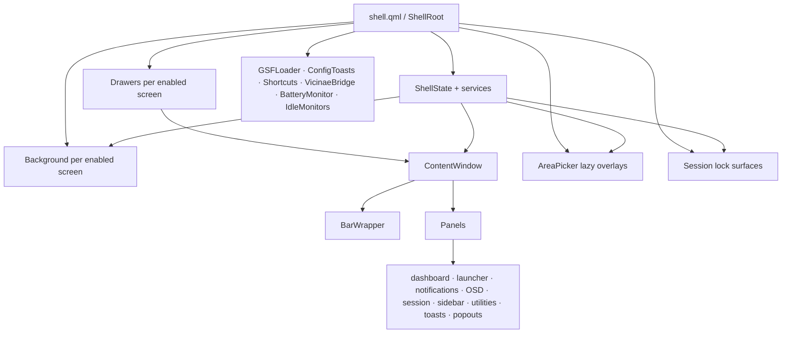

# Active Shell Component Inventory

## Scope

This inventory describes the active Quickshell tree rooted in `shell/shell.qml` at lines 16–43. It distinguishes compositor-visible surfaces from support objects, and it treats the bar, drawers, notification popups, OSD, utilities, toasts, and popouts as components composed inside one per-screen `ContentWindow`, not as independent operating-system windows (`shell/modules/drawers/Drawers.qml:7-25`; `shell/modules/drawers/ContentWindow.qml:251-335`; `shell/modules/drawers/Panels.qml:16-155`). “Shortcut” below means a registered `CustomShortcut.name`; the active QML does not define the user's external key combinations (`shell/components/misc/CustomShortcut.qml:3-7`; `shell/modules/Shortcuts.qml:17-186`).

## Component topology

The bootstrap creates independent background, drawer, picker, and lock roots alongside support-only roots. `Drawers` creates one `ContentWindow` per enabled screen; that window contains `BarWrapper` plus the shared `Panels` set. `ShellState` creates per-enabled-screen state and component registries, while service singletons supply shared data to surfaces (`shell/shell.qml:16-43`; `shell/services/ShellState.qml:9-99`; `shell/modules/drawers/Drawers.qml:7-25`; `shell/modules/drawers/ContentWindow.qml:251-335`; `shell/modules/drawers/Panels.qml:16-155`).

The diagram does not imply that the support branch renders UI: `GSFLoader` is a font loader, while the other support roots register handlers, observe state, emit toast records, or execute idle/battery policy (`shell/modules/GSFLoader.qml:1-6`; `shell/modules/ConfigToasts.qml:6-38`; `shell/modules/VicinaeBridge.qml:16-95`; `shell/modules/BatteryMonitor.qml:8-56`; `shell/modules/IdleMonitors.qml:12-76`).

## Bootstrap and runtime roots

| Bootstrap child/binding | Classification | Runtime responsibility | Visibility and scope | Source anchor |
|---|---|---|---|---|
| `ShellState.shellRoot` | Shared-state binding | Binds the live `ShellRoot` into the `ShellState` singleton. | Support-only; no surface. One process-wide binding. | `shell/shell.qml:21-25`; `shell/services/ShellState.qml:9-10` |
| `GSFLoader` | Asset support | Loads the bundled Google Sans Flex font. | Support-only; no surface. | `shell/shell.qml:27`; `shell/modules/GSFLoader.qml:1-6` |
| `Background` | Visible root | Creates the configured background stack for enabled screens. | One layershell window for each enabled screen whose background is enabled. | `shell/shell.qml:29`; `shell/modules/background/Background.qml:11-35` |
| `Drawers` | Visible composition root | Creates each screen's shared `ContentWindow`, bar, panels, interaction mask, and exclusion object. | One `ContentWindow` per enabled screen; its children are component surfaces, not separate windows. | `shell/shell.qml:30`; `shell/modules/drawers/Drawers.qml:7-25`; `shell/modules/drawers/ContentWindow.qml:251-335` |
| `AreaPicker` | Conditionally visible root | Registers picker IPC/shortcuts around an asynchronously activated set of screenshot overlays. | The root is eager; per-enabled-screen overlay windows exist only while its `LazyLoader` is active. | `shell/shell.qml:31`; `shell/modules/areapicker/AreaPicker.qml:10-80` |
| `Lock` | Conditionally visible root | Owns `WlSessionLock`, PAM, lock surfaces, and lock entry points. | The scope is eager; compositor lock surfaces are created while the session lock is active. | `shell/shell.qml:32-34`; `shell/modules/lock/Lock.qml:9-73` |
| `ConfigToasts` | Event support | Converts config/token load, save, and unknown-option events into shared toast records. | Support-only; records render through the toast stack. | `shell/shell.qml:36`; `shell/modules/ConfigToasts.qml:6-38` |
| `Shortcuts` | Entry-point support | Registers drawer, Nexus, and toaster shortcuts/IPC. | Support-only and eager; no surface. | `shell/shell.qml:37`; `shell/modules/Shortcuts.qml:11-248` |
| `VicinaeBridge` | Entry-point/service bridge | Registers TTS, STT, Shazam, mono, and bar-icon IPC and forces `IdleInhibitor` instantiation. | Support-only and eager; affected state is visible in utilities/bar. | `shell/shell.qml:38`; `shell/modules/VicinaeBridge.qml:16-95` |
| `BatteryMonitor` | Policy/event support | Observes UPower, emits charging/low-battery toasts, and hibernates after the critical timer. | Support-only; visible effects are toast records or the external session transition. | `shell/shell.qml:39`; `shell/modules/BatteryMonitor.qml:8-56` |
| `IdleMonitors` | Policy/event support | Applies configured idle/return actions and session-manager lock/unlock events to the shared `Lock`. | Support-only; may cause the separate lock surface or compositor/session actions. | `shell/shell.qml:40-42`; `shell/modules/IdleMonitors.qml:12-76` |

## Visible component inventory

| Surface | Visible behavior | Current entry points | State | Services/backends | Conditions/limits | Source anchors |
|---|---|---|---|---|---|---|
| Background window | Full-screen background/bottom layershell host behind the clock, wallpaper, and visualizer. | Created from bootstrap when screen/config filtering admits it. | Per-screen component reference `background`; no drawer boolean. | `Screens`, `ShellState`, per-screen `Config`. | Per enabled screen and only when that screen's `background.enabled` is true; layershell level depends on `wallpaperEnabled`. | `shell/modules/background/Background.qml:11-35`; `shell/services/Screens.qml:6-13` |
| Wallpaper layer | Cross-fades cached images and exposes a “Wallpaper missing?” file-picker state when its source becomes empty after initialization. | Wallpaper changes through launcher/Nexus UI or `wallpaper.*` IPC; missing-state button opens the file dialog. | Shared `Wallpapers.current`, preview, and actual-current state. | `Wallpapers`, `Colours`. | Asynchronous loader exists only when `wallpaperEnabled`; `Wallpapers` substitutes the bundled asset when its current-path file is empty or fails to load. | `shell/modules/background/Background.qml:42-51`; `shell/modules/background/Wallpaper.qml:14-41,73-85`; `shell/services/Wallpapers.qml:14-23,85-103` |
| Audio visualizer | Animated spectrum bars over the background; optional masked wallpaper blur. | Audio activity supplies values; no direct open toggle. | `Audio.cavaRef` reference count and visualizer offset/opacity. | `Audio`, `Colours`, `Hypr`. | Requires `visualiser.enabled`; `autoHide` suppresses it when the screen's active workspace has a non-floating toplevel. Heavy loaders are asynchronous and active only while visible. | `shell/modules/background/Visualiser.qml:12-81` |
| Desktop clock | Configurable-position time/date block with optional plate, blur, shadow, inversion, scale, and 12-hour suffix. | Config state only; no direct open toggle. | `Time` plus colour/game-mode state. | `Time`, `Colours`, `GameMode`. | Asynchronously loaded only when `desktopClock.enabled`; blur additionally requires its background/blur switches and is disabled in game mode. | `shell/modules/background/Background.qml:60-163`; `shell/modules/background/DesktopClock.qml:17-24,34-71,82-115` |
| Bar/taskbar | Vertical bar whose configured entries can include logo, workspaces, active window, tray, clock, status icons, power, and spacers. | `drawers.toggle("bar")`; left-edge hover/drag; logo click opens launcher; power click opens session; workspace and wheel interactions act directly. | Per-screen `bar`, plus local hover/popout state. | `Hypr`, `Audio`, `Brightness`, `Time`, `Nmcli`, `NetworkUsage`, `BarConfig`; system tray/Bluetooth/power services. | Per enabled screen. Hidden in fullscreen or on excluded screens; content loader is destroyed while hidden. Persistent mode or hover can show it without `bar=true`; configured entries determine actual contents. | `shell/modules/bar/BarWrapper.qml:13-89`; `shell/modules/bar/Bar.qml:33-135`; `shell/modules/bar/components/OsIcon.qml:14-20`; `shell/modules/bar/components/Power.qml:14-22` |
| Bar popouts and detached content | One named lazy popout at a time: active window, wireless/ethernet/password, Bluetooth, battery, audio, keyboard layout, network speed, system monitor, lock status, or a tray menu; selected content can detach into window info or embedded Nexus. | Pointer hover over eligible bar entries; active-window click when hover is disabled; tray navigation; detach/open-settings actions; Escape or focus loss closes. | Singleton `PopoutState.currentName/hasCurrent`; wrapper `detachedMode/queuedMode`. | `Hypr`, `Nmcli`, `Audio`, `NetworkUsage`, system tray/Bluetooth/power, Nexus state. | Popout/icon config gates apply. Each popout loader activates only for its name and deactivates after close animation; fullscreen closes the current popout. Embedded Nexus is not another bootstrap window. | `shell/modules/bar/Bar.qml:33-101`; `shell/modules/bar/popouts/Content.qml:13-227`; `shell/modules/bar/popouts/Wrapper.qml:23-62,87-149,169-217`; `shell/modules/drawers/ContentWindow.qml:61-66` |
| Dashboard | Top-center tabbed surface with Dashboard, Media, Performance, and Weather panes. | Named dashboard shortcuts, `showall`, `drawers.toggle("dashboard")`, top-edge hover/drag, tab click, and horizontal swipe. | Per-screen `dashboard`, `dashboardTab`, and `dashboardDate`. | `Weather`, `Time`, `Players`, `Audio`, `FanSpeeds`, `NetworkUsage`; CPU/GPU/memory/storage/lyrics/power services. | Requires `dashboard.enabled`; each tab and each performance card is separately gated. The performance pane shows “No widgets enabled” when every eligible card is off. Wrapper content loads for open/closing animation. Fullscreen blocks shortcut/IPC opens and forcibly closes it. | `shell/modules/dashboard/Wrapper.qml:14-52`; `shell/modules/dashboard/Content.qml:18-46,80-150`; `shell/modules/dashboard/Performance.qml:13-47`; `shell/modules/Shortcuts.qml:38-124,188-213`; `shell/modules/drawers/ContentWindow.qml:61-66` |
| Launcher | Bottom-center search surface for apps, actions, calculator, schemes, variants, and wallpaper mode. | `launcher`, `showall`, `drawers.toggle("launcher")`, bar-logo click, bottom-edge hover or drag, keyboard acceptance/Escape. | Per-screen `launcher`; launcher query/mode/provider state. | `Wallpapers`, `Colours`; launcher `Apps`, `Actions`, `Schemes`, `M3Variants`; desktop entries/session manager. | Requires `launcher.enabled`; content is lazy but app service loading is scheduled at wrapper completion. With no provider matches the model is simply empty. Fullscreen blocks shortcut/IPC opens and forcibly closes it. | `shell/modules/launcher/Wrapper.qml:12-59`; `shell/modules/launcher/AppList.qml:19-108`; `shell/modules/Shortcuts.qml:25-35,139-160,188-213`; `shell/modules/bar/components/OsIcon.qml:14-20`; `shell/modules/drawers/ContentWindow.qml:61-66` |
| Notification popups | Top-right list of active popup notification records, collision-limited against OSD/session/utilities. | New `NotificationServer` records; notification actions/dismiss gestures; `clearNotifs`; `notifs.*` IPC. | `Notifs.list/popups/dnd` and each `NotifData.popup/closed`. | `Notifs`, `NotifData`, `ShellState`, `Hypr`, notification server. | Wrapper is always composed but has zero height when no popup records. DND, any open sidebar, or configured fullscreen policy suppresses only popup creation; the record remains in history/sidebar. | `shell/services/Notifs.qml:17-38,75-103,133-167`; `shell/modules/notifications/Content.qml:28-73`; `shell/modules/notifications/Wrapper.qml:7-23` |
| OSD | Right-center lazy speaker, optional microphone, and optional brightness controls; changes auto-show it and a timer hides it. | Audio/brightness change signals and adjustment attempts; right-edge hover; `showall`; `drawers.toggle("osd")`; sliders/wheel. | Per-screen `osd`, local hover and sampled audio/brightness values. | `Audio`, per-screen `Brightness.Monitor`. | Requires `osd.enabled`; utilities suppress it. Microphone and brightness controls are independently configured. Loader is asynchronous and retained through close animation. In fullscreen only its carved right-edge region remains interactive. | `shell/modules/osd/Wrapper.qml:12-127`; `shell/modules/drawers/Interactions.qml:103-105,120-132,159-171`; `shell/modules/drawers/ContentWindow.qml:88-102` |
| Session/power panel | Right-center logout, shutdown, hibernate, and reboot actions around an optional animated image. | `session`; `drawers.toggle("session")`; bar power click; right-edge drag; Enter/click executes; Escape closes. | Per-screen `session`. | Session manager and configured session commands. | Requires `session.enabled`; content loads while open/closing. A failed `SessionManager.exec` falls back to detached execution. Fullscreen blocks shortcut/IPC opens and forcibly closes it. | `shell/modules/session/Wrapper.qml:10-38`; `shell/modules/session/Content.qml:22-104`; `shell/modules/bar/components/Power.qml:14-22`; `shell/modules/drawers/ContentWindow.qml:61-66` |
| Sidebar / notification center | Right-side grouped notification dock; utilities attach beneath/with it. | `sidebar`; `drawers.toggle("sidebar")`; configured top-right hover; right-edge drag; notification actions and clear controls. | Per-screen `sidebar`; sidebar-local `Props`; `Notifs` records. | `Notifs`, `NotifData`, `Colours`. | Requires `sidebar.enabled`; content is lazy through the close animation. Any open sidebar suppresses new popup presentation but not stored notification records. | `shell/modules/sidebar/Wrapper.qml:11-42`; `shell/services/Notifs.qml:32-38`; `shell/modules/drawers/Interactions.qml:134-197` |
| Utilities drawer | Bottom-right cards for keep-awake, recorder/history, and configured quick toggles; it widens into the open sidebar. | `utilities`, `showall`, `drawers.toggle("utilities")`, bottom-right hover, card/switch clicks; settings toggle opens Nexus; bridge IPC changes several toggle states. | Per-screen `utilities`; local persisted recording-list/delete/mode fields. | `IdleInhibitor`, `Recorder`, `Nmcli`, `Audio`, `GameMode`, `Notifs`, `VPN`, `Shazam`, `Mono`, `STT`, `TTS`, Bluetooth, Nexus factory. | Opens automatically with sidebar; otherwise requires `utilities.enabled`; an enabled open session suppresses ordinary utilities. Content loads asynchronously. Quick toggles are config-selected, and VPN is absent unless a provider is enabled. | `shell/modules/utilities/Wrapper.qml:14-89`; `shell/modules/VicinaeBridge.qml:19-95`; `shell/services/VPN.qml:20-45` |
| Toast stack | Bottom-right global toast records, placed left of sidebar and above utilities. | `toaster.info/success/warn/error`; config, battery, DND, idle, keyboard, media, audio, game, and VPN producers; any mouse button closes a toast. | Global `Toaster.toasts`; record `closed`/lock state. | `Toaster`, `Notifs` fullscreen detection, producer services. | Exists independently of utilities visibility. Fullscreen policy filters toast types, and `maxToasts` limits visible records. | `shell/modules/drawers/Panels.qml:137-143`; `shell/modules/utilities/toasts/Toasts.qml:10-59,62-103`; `shell/modules/Shortcuts.qml:223-240` |
| Area/screenshot picker | Full-screen live or frozen screencopy selection overlay on every enabled screen while activated. | `picker.open/openFreeze/openClip/openFreezeClip`; four screenshot shortcut names; drag selection and Escape. | Root `freeze`, `clipboardOnly`, `closing`, and `LazyLoader.activeAsync`. | `Screens`, `Hypr`, screencopy/save support. | Overlay windows do not exist until asynchronous activation. Freeze and clipboard-only modes alter capture behavior; closing empties the input mask before unload. | `shell/modules/areapicker/AreaPicker.qml:10-132` |
| Session lock | Wayland session-lock surfaces with screencopy background, authentication UI, clock/weather/resources, media, and notification dock. | `lock`, `unlock`; `lock.lock/unlock/isLocked`; idle timeouts and session-manager sleep/lock/unlock requests; PAM input. | `WlSessionLock.locked`, PAM state, per-surface unlock animation. | `Players`, `Weather`, `Time`, `Notifs`, `Hypr`; PAM/session manager; CPU/memory/storage and screencopy. | Lock scope is singleton/eager; surfaces exist only while locked. `Config.lock.enabled=false` hides the custom `lockContent`, but source does not establish what the compositor displays behind that transparent surface. Unlock completes only after the animation sets `locked=false`. | `shell/modules/lock/Lock.qml:9-73`; `shell/modules/lock/LockSurface.qml:10-28,31-84,174-184`; `shell/modules/IdleMonitors.qml:26-54` |
| Nexus floating/embedded settings | Dynamically created floating settings window or the same Nexus embedded in a detached bar popout. Pages cover wallpaper/style, network, Bluetooth, audio, panels, apps, services/notifications, language/region, and About. | `nexus`; `nexus.open`; utilities Settings toggle; bar-popout detach/open-settings actions; closing destroys its host. | Per-instance `NexusState`; singleton page/component registries; no `ScreenState` open boolean. | `WindowFactory`, `PageRegistry`, `PageCompRegistry` and page-specific active services. | A floating window is created per request and destroyed when hidden. Updates and Plugins are navigable but map to explicit “Page under construction” placeholders. | `shell/modules/nexus/WindowFactory.qml:10-59`; `shell/modules/nexus/PageRegistry.qml:8-92`; `shell/modules/nexus/PageCompRegistry.qml:22-168,170-201`; `shell/modules/bar/popouts/Wrapper.qml:130-149` |

All drawer-panel rows above share the one `Panels` item inside the same `ContentWindow`; `shell/modules/drawers/Panels.qml` is the authoritative immediate composition list at lines 16–155. `ContentWindow` also closes launcher, session, dashboard, and popouts when fullscreen state changes, while its fullscreen input region retains notification and OSD regions (`shell/modules/drawers/ContentWindow.qml:61-73,88-102`).

## State and service catalog

### Per-screen and component state
Per-screen drawer state is declared in `shell/components/ScreenState.qml`; shared lookup and component registration are declared by `ShellState`.

| Owner | Exposed state | Scope/persistence | Consumers | Source anchor |
|---|---|---|---|---|
| `ScreenState` | Exact booleans `bar`, `osd`, `session`, `launcher`, `dashboard`, `utilities`, `sidebar`; dashboard fields `dashboardTab` and `dashboardDate`. | One `PersistentProperties` instance per enabled screen. No `reloadableId` or backing path is declared here. | Bar and every major drawer wrapper; shortcuts, IPC, edge interactions, collision layout. | `shell/components/ScreenState.qml:3-18`; `shell/services/ShellState.qml:46-52` |
| `ShellState` | `shellRoot`; `forScreen`, `forActive`, `componentsFor`, `componentsForActive`, and `anySidebarOpen`. | Process-wide singleton resolving per-enabled-screen state. | Bootstrap binding, shortcuts/IPC, notification suppression, background and drawers. | `shell/services/ShellState.qml:9-60` |
| `ShellState.Components` / `ComponentRef` | Per-screen references `background`, `rootWindow`, `interactionWrapper`, `bar`, and `panels`; helper child searches. | One registry per enabled screen; a `ComponentRef` clears its slot on destruction. | Cross-surface lookups and background/bar layout coupling. | `shell/services/ShellState.qml:62-99`; `shell/modules/background/Background.qml:31-35`; `shell/modules/drawers/ContentWindow.qml:313-335` |
| Bar popout state | `currentName`, `hasCurrent`, detach request; wrapper `detachedMode`, `queuedMode`, current content. | Process singleton state consumed by each bar-popout wrapper; no persistence declared. | Bar hover/tray logic, detached window info, embedded Nexus. | `shell/modules/bar/popouts/Wrapper.qml:23-62,87-149` |
| Utilities state | `recordingListExpanded`, `recordingConfirmDelete`, `recordingMode`. | Per-wrapper `PersistentProperties`, reload ID `utilities`. | Recorder/history card and utilities layout. | `shell/modules/utilities/Wrapper.qml:20-30` |

### Active service singletons consumed by inventoried surfaces

| Service | Exposed state | Persistence/reload ID | Inventoried consumers | Source anchor |
|---|---|---|---|---|
| `ShellState` | Per-screen state/component resolution and `shellRoot`. | No persistence declared in the singleton; its `ScreenState` children are persistent without a declared reload ID. | All per-screen backgrounds/drawers, shortcuts, notification suppression. | `shell/services/ShellState.qml:9-99` |
| `Screens` | Enabled `ShellScreen` list and exclusion test. | None declared. | Background, drawers, area picker, `ShellState`. | `shell/services/Screens.qml:6-13` |
| `Hypr` | Toplevels, workspaces, monitors, focused objects, keyboard/lock-key state, compositor options/devices, dispatch helpers. | None declared. | Bar/workspaces/popouts, background auto-hide, fullscreen policy, picker, lock, game mode, `ShellState`. | `shell/services/Hypr.qml:12-43,45-137` |
| `Colours` | Current/preview scheme, light mode, material palettes, transparency, wallpaper luminance. | Watches state `scheme.json`; no reload ID. | Every styled surface, wallpaper previews, background effects. | `shell/services/Colours.qml:12-29,62-83,116-127` |
| `Wallpapers` | `current`, `actualCurrent`, preview path/show/colour-lock state, searchable wallpaper list. | Watches current-path state file; no reload ID. | Background wallpaper, launcher wallpaper mode, Nexus appearance. | `shell/services/Wallpapers.qml:11-23,62-68,85-112` |
| `Audio` | Default sink/source, volumes/mutes, nodes/streams, Cava provider reference, beat tracker, adjustment signals. | None declared. | Bar and popouts, OSD, dashboard/media, visualizer, utilities, Nexus audio. | `shell/services/Audio.qml:12-42,160-201` |
| `Brightness` | Per-screen monitor objects, DDC map, Apple-display detection, brightness getters/setters. | None declared. | Bar wheel/active-window context, OSD, shortcut/IPC. | `shell/services/Brightness.qml:10-73,164-238` |
| `Players` | MPRIS player list, selected active/manual player, identity/art fallback helpers. | `PersistentProperties` reload ID `players` for manual active player. | Dashboard media, lock media, idle audio inhibition, media shortcut/IPC. | `shell/services/Players.qml:11-45,60-66` |
| `Notifs` | Notification list, open records, popup subset, DND, loaded state, popup policy. | DND reload ID `notifs`; notification history file is read/written by the service. | Popup stack, sidebar, lock notification dock, toast fullscreen check, notification entry points. | `shell/services/Notifs.qml:14-38,50-131` |
| `Nmcli` | Wireless/ethernet interfaces, connection/scanning state, access points, saved connections, active devices. | None declared. | Bar status/popouts, utilities network toggle, Nexus network. | `shell/services/Nmcli.qml:8-42` |
| `BarConfig` | Extra bar switches `showCpu`, `showRam`, `showUpload`, `showDownload`, `showLyrics`. | File-backed JSON adapter; no reload ID. | Bar status/lyrics and `barIcons` bridge. | `shell/services/BarConfig.qml:7-31`; `shell/modules/VicinaeBridge.qml:73-95` |
| `NetworkUsage` | Download/upload speeds and totals plus history buffers and reference count. | None declared. | Bar network-speed popout/status and dashboard performance network card. | `shell/services/NetworkUsage.qml:9-41,139-163` |
| `Time` | Live date/hours/minutes/seconds and formatted clock components. | None declared. | Bar clock, desktop clock, dashboard/calendar/weather, lock, recorder elapsed connection. | `shell/services/Time.qml:7-28` |
| `Weather` | Location/city, current conditions, forecast/hourly forecast, formatted temperature/wind/sun state. | In-memory cache only; no reload ID declared. | Dashboard weather and lock weather. | `shell/services/Weather.qml:9-27,262-281` |
| `FanSpeeds` | CPU/GPU RPM and consumer `refCount`. | None declared. | Dashboard performance hero cards. | `shell/services/FanSpeeds.qml:8-18,63-85`; `shell/modules/dashboard/Performance.qml:68-105` |
| `Recorder` | Running, paused, elapsed, pending start/stop/pause requests and start arguments. | `PersistentProperties` reload ID `recorder`. | Utilities recorder/history card and recording status surfaces. | `shell/services/Recorder.qml:7-42` |
| `IdleInhibitor` | Enabled state, enabled-since time, battery-origin state. | `PersistentProperties` reload ID `idleInhibitor`. | Utilities Keep Awake, toast producer, eager bridge IPC. | `shell/services/IdleInhibitor.qml:10-40`; `shell/modules/VicinaeBridge.qml:19-23` |
| `GameMode` | Enabled state and compositor-config application. | `PersistentProperties` reload ID `gameMode`. | Utilities toggle, desktop-clock blur gate, background/style behavior. | `shell/services/GameMode.qml:10-38`; `shell/modules/background/DesktopClock.qml:17-20` |
| `VPN` | Enabled provider, connected/connecting status, provider configuration, connect/disconnect/toggle state. | None declared. | Config-selected utilities VPN toggle/toasts. | `shell/services/VPN.qml:9-45,83-107` |
| `Shazam` | Recognition process `running` and `toggle()`. | None declared. | Utilities quick toggle and eager `shazam.*` bridge IPC. | `shell/services/Shazam.qml:7-20`; `shell/modules/VicinaeBridge.qml:49-59` |
| `Mono` | Mono-audio `active` and `toggle()`. | Watches an external state file; no reload ID. | Utilities quick toggle and eager `mono.*` bridge IPC. | `shell/services/Mono.qml:7-29`; `shell/modules/VicinaeBridge.qml:61-70` |
| `STT` | Speech-to-text process `recording` and `toggle()`. | None declared. | Utilities quick toggle and eager `stt.*` bridge IPC. | `shell/services/STT.qml:7-20`; `shell/modules/VicinaeBridge.qml:37-47` |
| `TTS` | Text-to-speech process `speaking` and `toggle()`. | None declared. | Utilities quick toggle and eager `tts.*` bridge IPC. | `shell/services/TTS.qml:7-20`; `shell/modules/VicinaeBridge.qml:25-35` |

`NotifData` is the per-record model rather than a singleton: it owns popup/closed/lock/timing/content/action state and removes itself from `Notifs.list` when closed and unlocked (`shell/services/NotifData.qml:11-40,200-217`).

## Entry-point index

Registered `CustomShortcut` values are application-scoped names, not literal key combinations. The single unnamed `GlobalShortcut` is the `CustomShortcut` wrapper with `appid: "caelestia"` (`shell/components/misc/CustomShortcut.qml:3-7`). Bootstrap handlers in `Shortcuts`, `VicinaeBridge`, `AreaPicker`, and `Lock` are registered eagerly because those roots are direct `ShellRoot` children; service-local handlers/shortcuts register when their singleton is instantiated by a consumer (`shell/shell.qml:31-40`; `shell/modules/Shortcuts.qml:11-240`; `shell/modules/VicinaeBridge.qml:16-95`; `shell/modules/areapicker/AreaPicker.qml:10-132`; `shell/modules/lock/Lock.qml:9-73`).

| Surface/service | Entry point | Handler/observable behavior | Registration/lifecycle | Source anchor |
|---|---|---|---|---|
| Shortcut namespace | Unnamed `GlobalShortcut` wrapper | Supplies application ID `caelestia` to every `CustomShortcut`; it is not itself a named user action. | Component definition used by named shortcuts. | `shell/components/misc/CustomShortcut.qml:3-7` |
| Nexus | `nexus` | Creates a new Nexus floating window. | Named shortcut in eager `Shortcuts`. | `shell/modules/Shortcuts.qml:17-23` |
| Combined drawers | `showall` | Outside fullscreen, toggles launcher, dashboard, OSD, and utilities together on the active screen. | Named shortcut in eager `Shortcuts`. | `shell/modules/Shortcuts.qml:25-36` |
| Dashboard | `dashboard`, `dashboardMedia`, `dashboardPerformance`, `dashboardWeather` | Toggles dashboard or selects/toggles the configured tab; disabled tab shortcuts fall back to toggling dashboard. Fullscreen is refused. | Named shortcuts in eager `Shortcuts`. | `shell/modules/Shortcuts.qml:38-124` |
| Session | `session` | Toggles the active screen's session panel unless fullscreen. | Named shortcut in eager `Shortcuts`. | `shell/modules/Shortcuts.qml:126-137` |
| Launcher | `launcher`, `launcherInterrupt` | Launcher toggles on release unless interrupted/fullscreen; interrupt marks that press cycle as cancelled. | Named shortcuts in eager `Shortcuts`. | `shell/modules/Shortcuts.qml:139-160` |
| Sidebar | `sidebar` | Toggles the active screen's sidebar unless fullscreen. | Named shortcut in eager `Shortcuts`. | `shell/modules/Shortcuts.qml:162-173` |
| Utilities | `utilities` | Toggles the active screen's utilities unless fullscreen. | Named shortcut in eager `Shortcuts`. | `shell/modules/Shortcuts.qml:175-186` |
| Screenshot picker | `screenshot`, `screenshotFreeze`, `screenshotClip`, `screenshotFreezeClip` | Activates picker in live/frozen and file/clipboard combinations. | Named shortcuts outside the picker `LazyLoader`, therefore eager. | `shell/modules/areapicker/AreaPicker.qml:82-132` |
| Session lock | `lock`, `unlock` | Sets locked or emits unlock. | Named shortcuts in eager `Lock`. | `shell/modules/lock/Lock.qml:43-57` |
| Audio | `volumeUp`, `volumeDown`, `volumeMute`, `micMute` | Adjusts sink volume/mute or source mute. | Service-local named shortcuts; register with `Audio` singleton instantiation. | `shell/services/Audio.qml:211-241` |
| Brightness | `brightnessUp`, `brightnessDown` | Adjusts the active monitor brightness. | Service-local named shortcuts; register with `Brightness` singleton instantiation. | `shell/services/Brightness.qml:95-109` |
| Hypr device state | `refreshDevices` | Refreshes compositor devices on press and release. | Service-local named shortcut; register with `Hypr` singleton instantiation. | `shell/services/Hypr.qml:260-267` |
| Notifications | `clearNotifs` | Closes every current notification record. | Service-local named shortcut; register with `Notifs` singleton instantiation. | `shell/services/Notifs.qml:133-142` |
| Media | `mediaToggle`, `mediaPrev`, `mediaNext`, `mediaStop` | Applies supported playback operation to the active MPRIS player. | Service-local named shortcuts; register with `Players` singleton instantiation. | `shell/services/Players.qml:68-110` |
| Drawers | `drawers.toggle`, `drawers.list`, `drawers.isOpen` | Toggles a boolean active-screen state, lists boolean state keys, or reports `1`, `0`, or `unknown`; fullscreen refuses launcher/session/dashboard toggles. | Eager bootstrap IPC in `Shortcuts`. | `shell/modules/Shortcuts.qml:188-213` |
| Nexus | `nexus.open` | Creates a Nexus floating window. | Eager bootstrap IPC in `Shortcuts`. | `shell/modules/Shortcuts.qml:215-221` |
| Toasts | `toaster.info`, `toaster.success`, `toaster.warn`, `toaster.error` | Creates a toast record of the corresponding type. | Eager bootstrap IPC in `Shortcuts`. | `shell/modules/Shortcuts.qml:223-240` |
| Text to speech | `tts.toggle`, `tts.isSpeaking` | Toggles TTS process and reports speaking state. | Eager bridge IPC. | `shell/modules/VicinaeBridge.qml:25-35` |
| Speech to text | `stt.toggle`, `stt.isRecording` | Toggles STT process and reports recording state. | Eager bridge IPC. | `shell/modules/VicinaeBridge.qml:37-47` |
| Recognition | `shazam.toggle`, `shazam.isRunning` | Toggles recognition and reports process state. | Eager bridge IPC. | `shell/modules/VicinaeBridge.qml:49-59` |
| Mono audio | `mono.toggle`, `mono.isActive` | Toggles mono-audio mode and reports observed state. | Eager bridge IPC. | `shell/modules/VicinaeBridge.qml:61-70` |
| Bar status switches | `barIcons.isExtra`, `barIcons.toggle`, `barIcons.get` | Classifies extra status switches and reads/toggles either `BarConfig` or global bar status config. | Eager bridge IPC. | `shell/modules/VicinaeBridge.qml:73-95` |
| Picker | `picker.open`, `picker.openFreeze`, `picker.openClip`, `picker.openFreezeClip` | Sets live/freeze and file/clipboard modes, clears closing, and activates the asynchronous picker loader. | Eager IPC outside the lazy overlay. | `shell/modules/areapicker/AreaPicker.qml:50-80` |
| Lock | `lock.lock`, `lock.unlock`, `lock.isLocked` | Locks, starts unlock, or reports lock state. | Eager bootstrap IPC in `Lock`. | `shell/modules/lock/Lock.qml:59-73` |
| Audio | `audio.cycleOutput` | Selects the next discovered output sink. | Service-local IPC; registers with `Audio` singleton instantiation. | `shell/services/Audio.qml:203-209` |
| Brightness | `brightness.get`, `brightness.getFor`, `brightness.set`, `brightness.setFor` | Reads or changes active/named monitor brightness; setters parse absolute and relative values and return status text. | Service-local IPC; registers with `Brightness` singleton instantiation. | `shell/services/Brightness.qml:111-162` |
| Game mode | `gameMode.isEnabled`, `gameMode.toggle`, `gameMode.enable`, `gameMode.disable` | Reads or changes game-mode state. | Service-local IPC; registers when utilities/background consumers instantiate `GameMode`. | `shell/services/GameMode.qml:49-67` |
| Idle inhibitor | `idleInhibitor.isEnabled`, `idleInhibitor.toggle`, `idleInhibitor.enable`, `idleInhibitor.disable` | Reads or changes keep-awake state. | Service-local handler, but `VicinaeBridge` eagerly reads `IdleInhibitor.enabled` to force registration. | `shell/services/IdleInhibitor.qml:63-81`; `shell/modules/VicinaeBridge.qml:19-23` |
| Hypr device/workspace state | `hypr.refreshDevices`, `hypr.cycleSpecialWorkspace`, `hypr.listSpecialWorkspaces` | Refreshes device data, cycles open special workspaces, or lists them. | Service-local IPC; `Hypr` is consumed by eager `Shortcuts`. | `shell/services/Hypr.qml:244-258`; `shell/modules/Shortcuts.qml:14-15` |
| Notifications | `notifs.clear`, `notifs.isDndEnabled`, `notifs.toggleDnd`, `notifs.enableDnd`, `notifs.disableDnd` | Clears records or reads/changes DND. | Service-local IPC; notification popup composition consumes `Notifs`. | `shell/services/Notifs.qml:144-167`; `shell/modules/notifications/Content.qml:68-73` |
| Media | `mpris.getActive`, `mpris.list`, `mpris.play`, `mpris.pause`, `mpris.playPause`, `mpris.previous`, `mpris.next`, `mpris.stop` | Queries players or applies supported playback operation to the active player. | Service-local IPC; registers with `Players` singleton instantiation. | `shell/services/Players.qml:112-157` |
| Wallpaper | `wallpaper.get`, `wallpaper.set`, `wallpaper.list` | Returns current wallpaper, sets a path, or lists indexed wallpaper paths. | Service-local IPC; registration follows `Wallpapers` instantiation by background/launcher/Nexus consumers. | `shell/services/Wallpapers.qml:62-83` |
| Bar and popouts | Left-edge hover/drag; bar pointer hover; bar wheel; logo and power clicks | Reveals/hides bar, opens/closes named popouts, changes workspace/audio/brightness, and toggles launcher/session. | Per-screen `Interactions` and bar content; unavailable while fullscreen except OSD hover region. | `shell/modules/drawers/Interactions.qml:54-66,94-118,240-246`; `shell/modules/bar/Bar.qml:33-127`; `shell/modules/bar/components/OsIcon.qml:14-20`; `shell/modules/bar/components/Power.qml:14-22` |
| Launcher and dashboard | Bottom-edge hover/vertical drag; top-edge hover/vertical drag | Opens/closes launcher and dashboard according to each surface's hover/drag configuration. | Per-screen `Interactions`; direct pointer path is suppressed in fullscreen. | `shell/modules/drawers/Interactions.qml:199-227` |
| OSD, session, sidebar, utilities | Right-edge hover/drag and bottom-right hover | Shows OSD on its edge; drags session/sidebar open or closed; optionally hovers sidebar; hovers utilities. | Per-screen `Interactions`; fullscreen retains only OSD hover handling. | `shell/modules/drawers/Interactions.qml:103-105,120-197,229-238` |
| Focus/escape closure | Focus-grab clear, pointer leave, Escape | Closes major drawers/popouts and tray according to hover/shortcut ownership; detached popout focus loss closes it. | Per-screen drawer focus grab and interaction wrapper; popout wrapper lifecycle. | `shell/modules/drawers/ContentWindow.qml:112-134`; `shell/modules/drawers/Interactions.qml:67-91`; `shell/modules/bar/popouts/Wrapper.qml:59-78,93-97` |
