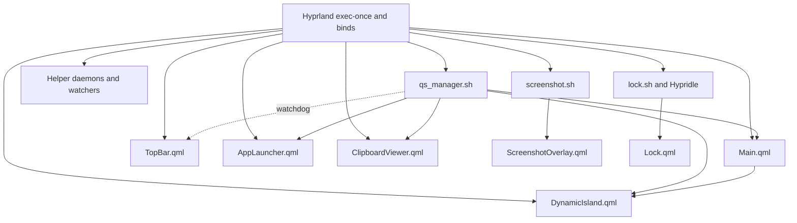

# ActivSpot Reference Analysis

## Evidence labels

- **Fact** records directly observed repository behavior and is followed by a repository-relative source anchor.
- **[INFERENCE]** records a technical consequence derived from cited facts rather than behavior stated by the source.
- **Recommendation:** records adaptation judgment. It does not describe current ActivSpot or active-shell behavior and does not select a final visual direction.
- **Observed complexity** uses the approved precedence rule High → Medium → Low. **High** names a cross-surface/compositor, security/session, durable-schema/daemon, substantial-model, or multiple-integration trigger. **Medium** names several coordinated UI files or one bounded external integration. **Low** names a localized UI path over an existing source without a higher trigger.

## Architecture and entry points

ActivSpot is a multi-process shell. Hyprland starts five independent, resident Quickshell roots: `Main.qml`, `TopBar.qml`, `DynamicIsland.qml`, `AppLauncher.qml`, and `ClipboardViewer.qml`. The same autostart block also launches `awww-daemon`, `hypridle`, `focus_daemon.py`, `settings_watcher.sh`, `playerctld`, two `wl-paste --watch` processes, `volume_listener.sh`, and `update_notifier.sh`; it loads two audio modules and enables EasyEffects separately (`references/repos/activspot/hyprland.conf:31-50`). `qs_manager.sh` independently checks for and restarts each of the five Quickshell roots on nonnumeric manager invocations (`references/repos/activspot/scripts/qs_manager.sh:111-142`).

| Runtime root or helper | Window/state ownership | Entry and lifecycle | Source anchors |
|---|---|---|---|
| `Main.qml` | One screen-sized overlay `PanelWindow` named `qs-master`; owns the master popup `StackView`, active-widget geometry, a `NotificationServer`, and notification models. | Hyprland autostart; `qs_manager.sh` watchdog; commands arrive through `/tmp/qs_widget_state`. | `references/repos/activspot/hyprland.conf:33`; `references/repos/activspot/scripts/quickshell/Main.qml:10-47,63-134,231-260,317-375`; `references/repos/activspot/scripts/qs_manager.sh:113-122` |
| `TopBar.qml` | `Variants` creates one top `PanelWindow` for every `Quickshell.screens` entry; each delegate owns local models and process watchers. | Hyprland autostart; `qs_manager.sh` watchdog. | `references/repos/activspot/hyprland.conf:34`; `references/repos/activspot/scripts/quickshell/TopBar.qml:10-48,123-159,171-216,291-396`; `references/repos/activspot/scripts/qs_manager.sh:114-127` |
| `DynamicIsland.qml` | One top-layer `PanelWindow`; owns contextual-page arbitration and island-local music, equalizer, notification, recording, OSD, VPN, Discord, weather, volume, and pet inputs. | Hyprland autostart; `qs_manager.sh` watchdog; dedicated files and compositor-socket events update it. | `references/repos/activspot/hyprland.conf:35`; `references/repos/activspot/scripts/quickshell/DynamicIsland.qml:13-27,47-203,240-257,267-383,434-560,1356-1487`; `references/repos/activspot/scripts/qs_manager.sh:115-132` |
| `AppLauncher.qml` | One four-edge overlay `PanelWindow` with its own focus, open state, app models, filtering, and execution processes. | Resident from Hyprland autostart; visibility toggled through `/tmp/qs_launcher`; `qs_manager.sh` watchdog. | `references/repos/activspot/hyprland.conf:36,262`; `references/repos/activspot/scripts/quickshell/AppLauncher.qml:7-58,60-150`; `references/repos/activspot/scripts/qs_manager.sh:116-137,192-196` |
| `ClipboardViewer.qml` | One four-edge overlay `PanelWindow` with its own focus, open state, history models, filtering, decode, and copy processes. | Resident from Hyprland autostart; visibility toggled through `/tmp/qs_clipboard`; `qs_manager.sh` watchdog. | `references/repos/activspot/hyprland.conf:37,251`; `references/repos/activspot/scripts/quickshell/ClipboardViewer.qml:7-49,51-128`; `references/repos/activspot/scripts/qs_manager.sh:117-142,198-201` |
| `Lock.qml` | On-demand `ShellRoot` with a `WlSessionLock`, per-output `WlSessionLockSurface`, shared PAM state, and surface-local polling; it is not a persistent `PanelWindow`. | `lock.sh`, manual power/lock binds, and Hypridle launch it. | `references/repos/activspot/scripts/lock.sh:1-3`; `references/repos/activspot/hyprland.conf:275-276`; `references/repos/activspot/hypridle.conf:19-27`; `references/repos/activspot/scripts/quickshell/Lock.qml:13-66,83-118,139-218` |
| `ScreenshotOverlay.qml` | On-demand exclusive overlay `PanelWindow` on `Quickshell.cursorScreen`; owns selection geometry and returns it to `screenshot.sh`. | Print binds call `screenshot.sh`; only the no-full/no-geometry path starts this QML root, which quits after dispatching capture. | `references/repos/activspot/hyprland.conf:269-274`; `references/repos/activspot/scripts/screenshot.sh:95-126,191-192`; `references/repos/activspot/scripts/quickshell/ScreenshotOverlay.qml:9-21,72-77,420-425` |
| Helper processes | `focus_daemon.py` owns durable activity tracking; watcher/listener scripts own settings, clipboard ingestion, volume, update, workspace, and hardware-event feeds; wallpaper/audio helpers are separate processes. | Mostly Hyprland `exec-once`; feature QML also starts bounded or long-lived shell processes. | `references/repos/activspot/hyprland.conf:31-50`; `references/repos/activspot/scripts/quickshell/focustime/focus_daemon.py:327-449`; `references/repos/activspot/scripts/quickshell/TopBar.qml:171-215,281-396`; `references/repos/activspot/scripts/quickshell/DynamicIsland.qml:267-348,1429-1467` |

`qs_manager.sh` is both a watchdog and a command router. Numeric arguments close the central popup then dispatch a Hyprland workspace before reaching the watchdog; other calls check all five roots, special-case network, music, launcher, clipboard, and wallpaper, and route remaining names to the master popup (`references/repos/activspot/scripts/qs_manager.sh:23-34,111-142,145-213`). `Main.qml` validates master-popup commands against `WindowRegistry.js`, computes geometry, and replaces the `StackView` component (`references/repos/activspot/scripts/quickshell/Main.qml:177-199,262-339,341-375`; `references/repos/activspot/scripts/quickshell/WindowRegistry.js:24-64`).

The diagram contains only the launch and routing relationships described by those sources. The notification edge is the serialized message written by `Main.qml`; the launcher, clipboard, island, and master edges are manager-owned file routes; the two on-demand branches are keybind/script launch paths (`references/repos/activspot/scripts/quickshell/Main.qml:120-131`; `references/repos/activspot/scripts/qs_manager.sh:145-213`; `references/repos/activspot/hyprland.conf:251-276`; `references/repos/activspot/scripts/screenshot.sh:191-192`; `references/repos/activspot/scripts/lock.sh:1-3`).

The central `/tmp/qs_*` routes are `/tmp/qs_widget_state` for master widgets, `/tmp/qs_active_widget` for the currently published master name, `/tmp/qs_island_toggle`, `/tmp/qs_launcher`, `/tmp/qs_clipboard`, `/tmp/qs_launcher_state`, `/tmp/qs_island_notif`, `/tmp/qs_osd`, and `/tmp/qs_workspaces.json`; most QML consumers run one-shot `inotifywait`, read/remove one file, and restart the watcher (`references/repos/activspot/scripts/qs_manager.sh:145-213`; `references/repos/activspot/scripts/quickshell/Main.qml:341-375`; `references/repos/activspot/scripts/quickshell/AppLauncher.qml:132-150`; `references/repos/activspot/scripts/quickshell/ClipboardViewer.qml:111-128`; `references/repos/activspot/scripts/quickshell/DynamicIsland.qml:484-497,1356-1487`; `references/repos/activspot/scripts/quickshell/TopBar.qml:178-215`).

## Feature matrix

| User-facing feature | Interaction pattern | Relevant source locations | Backend dependencies | Observed complexity |
|---|---|---|---|---|
| Top bar | Per-screen anchored bar with workspaces, app/window affordances, tray, clock, layout, network, Bluetooth, audio, and battery targets; it reserves a center gap for the separate island. | Presentation/entry: `references/repos/activspot/scripts/quickshell/TopBar.qml:10-48,421-443,499-503,591-595,655-719,744-930`; process entry: `references/repos/activspot/hyprland.conf:34`. Backend/state: `references/repos/activspot/scripts/quickshell/TopBar.qml:123-159,171-216,218-396`. | Quickshell Wayland, IO, and SystemTray; Hyprland; `inotifywait`; MPRIS DBus; workspace, keyboard, audio, network, Bluetooth, and battery helpers. | **High** — trigger: per-screen compositor surface coordinated with multiple process/service integrations and local state models. |
| Contextual island overall | Collapsed pill expands on click, cycles contexts, arbitrates temporary OSD/notification content and persistent clock/music/Discord/recording contexts, and renders secondary badges. | Presentation/entry: `references/repos/activspot/scripts/quickshell/DynamicIsland.qml:13-27,636-675,812-1075,1078-1354`; process entry: `references/repos/activspot/hyprland.conf:35`. Backend/state: `references/repos/activspot/scripts/quickshell/DynamicIsland.qml:47-203,240-257,267-560,1356-1487`. | Quickshell IO/Wayland, Qt effects, media/audio tools, OpenWeather helper, capture state, notification IPC, Hyprland socket, and `/tmp/qs_*` routes. | **High** — trigger: cross-surface contextual arbitration, substantial custom state/page model, and multiple process/service integrations. |
| Island clock/weather | Default collapsed clock and weather; expansion shows seconds, date, and current conditions. | Presentation: `references/repos/activspot/scripts/quickshell/collapsed/ClockCollapsed.qml:5-60`; `references/repos/activspot/scripts/quickshell/pages/ClockPage.qml:13-60`. Backend/state: `references/repos/activspot/scripts/quickshell/DynamicIsland.qml:197-203,350-383`; `references/repos/activspot/scripts/quickshell/calendar/weather.sh:15-24,84-104`. | JavaScript `Date`; Bash; `jq`; `curl`; OpenWeather forecast API and cache. | **Medium** — trigger: coordinated collapsed/expanded UI plus one bounded remote-weather integration. |
| Island music/equalizer | Media activates music context; collapsed view has art, playback, progress, and CAVA bars; expanded view adds seeking, transport, presets, and ten EQ bands. | Presentation: `references/repos/activspot/scripts/quickshell/collapsed/MusicCollapsed.qml:8-87`; `references/repos/activspot/scripts/quickshell/pages/MusicPage.qml:24-247`. Backend/state: `references/repos/activspot/scripts/quickshell/DynamicIsland.qml:84-101,271-348,562-575`; `references/repos/activspot/scripts/quickshell/music/music_info.sh:13-24,26-69,96-126`; `references/repos/activspot/scripts/quickshell/music/equalizer.sh:3-40,49-82`. | `playerctl`, MPRIS DBus, CAVA, EasyEffects, `jq`, Python, ImageMagick, `curl`, PipeWire-compatible audio. | **High** — trigger: multiple media/DSP integrations, live subprocess state, and coordinated collapsed/expanded controls. |
| Island Discord | Call pill/timer can coexist with another context; expanded page shows duration and microphone mute. | Presentation: `references/repos/activspot/scripts/quickshell/collapsed/DiscordCollapsed.qml:4-62`; `references/repos/activspot/scripts/quickshell/pages/DiscordPage.qml:11-81`. Backend/state: `references/repos/activspot/scripts/quickshell/DynamicIsland.qml:113-116,457-482`. | `pactl` source-output metadata for Discord detection; `wpctl` microphone mute; timers. | **Medium** — trigger: several coordinated QML presentations around one bounded audio-session integration. |
| Island notifications | Incoming notification temporarily expands the island, then leaves an unread badge; history page supports DND, dismissal, and clear-all. | Presentation: `references/repos/activspot/scripts/quickshell/pages/NotifsPage.qml:17-158`; `references/repos/activspot/scripts/quickshell/DynamicIsland.qml:385-407,1015-1134`. Backend/state: `references/repos/activspot/scripts/quickshell/Main.qml:63-134`; `references/repos/activspot/scripts/quickshell/DynamicIsland.qml:103-108,146-147,218-227,530-560,1356-1401`. | Quickshell `NotificationServer`; `/tmp/qs_island_notif`; `inotifywait`; JSON history and DND cache; `paplay`. | **High** — trigger: notification-server ownership, cross-process delivery, persistent history/DND policy, and coordinated transient presentation. |
| Island recording | Recording stays as a secondary pulsing bubble; click opens elapsed-time, pause/resume, and stop controls. | Presentation: `references/repos/activspot/scripts/quickshell/pages/RecordingPage.qml:11-150`; `references/repos/activspot/scripts/quickshell/DynamicIsland.qml:140-179,577-587,1271-1353`. Backend/state: `references/repos/activspot/scripts/quickshell/DynamicIsland.qml:500-528`; `references/repos/activspot/scripts/screenshot.sh:4-77,126-170`. | `wl-screenrec`, FFmpeg, `pactl`, Unix signals, process/cache files, `notify-send`. | **High** — trigger: multi-process audio/video lifecycle and cross-surface recording-state protocol. |
| Island OSD | Volume, brightness, or keyboard-layout events temporarily replace collapsed island content, then auto-hide. | Presentation: `references/repos/activspot/scripts/quickshell/collapsed/OSDCollapsed.qml:4-89`; `references/repos/activspot/scripts/quickshell/DynamicIsland.qml:118-126,640-646,725-730,890-896`. Backend/state: `references/repos/activspot/scripts/quickshell/DynamicIsland.qml:1404-1467`; `references/repos/activspot/scripts/osd_volume.sh:1-18`; `references/repos/activspot/scripts/osd_brightness.sh:1-11`. | `pactl`, `brightnessctl`, `inotifywait`, `socat`, and Hyprland socket events. | **Medium** — trigger: several coordinated transient UI paths over bounded external actuation/event integrations. |
| Island VPN | A WireGuard interface produces a temporary transition badge and a small active lock under weather. | Presentation/state: `references/repos/activspot/scripts/quickshell/DynamicIsland.qml:128-138,434-455,1136-1197`; `references/repos/activspot/scripts/quickshell/collapsed/ClockCollapsed.qml:25-60`. | `ip link` WireGuard-interface probe and local timer. | **Low** — trigger: localized status/badge path over one existing shell-derived data source. |
| Island pet | Animated cat changes local state from media and notification booleans. | Presentation/state: `references/repos/activspot/scripts/quickshell/pet/CatPill.qml:6-18,90-147,149-227`; host inputs: `references/repos/activspot/scripts/quickshell/collapsed/ClockCollapsed.qml:63-69`; `references/repos/activspot/scripts/quickshell/collapsed/MusicCollapsed.qml:81-87`. | Qt Quick Canvas, timers, and host-provided booleans; no external service in the component. | **Low** — trigger: localized leaf UI with local state and no external backend ownership. |
| Master popup/registry | Outside-click/Escape closes one morphing full-screen popup host; names select geometry and component paths in a shared registry. | Presentation/entry: `references/repos/activspot/scripts/quickshell/Main.qml:10-40,205-339`; `references/repos/activspot/scripts/qs_manager.sh:144-213`. Backend/state: `references/repos/activspot/scripts/quickshell/Main.qml:42-61,177-199,317-385`; `references/repos/activspot/scripts/quickshell/WindowRegistry.js:24-64`. | Quickshell IO/Wayland, `StackView`, `inotifywait`, string component paths, `/tmp/qs_widget_state`. | **High** — trigger: compositor-level popup/focus ownership, cross-process routing, and centralized component/geometry lifecycle. |
| Launcher | Super+Space opens a resident full-screen launcher that morphs from the island position; fuzzy text, keyboard, and pointer actions filter and launch desktop entries. | Presentation/entry: `references/repos/activspot/hyprland.conf:262`; `references/repos/activspot/scripts/quickshell/AppLauncher.qml:7-58,152-319`. Backend/state: `references/repos/activspot/scripts/quickshell/AppLauncher.qml:60-150`; `references/repos/activspot/scripts/get_apps.sh:33-82`. | Quickshell IO/Wayland, Bash, desktop-entry trees, `gtk-launch`, optional Flatpak, and `/tmp/qs_launcher`. | **Medium** — trigger: one coordinated UI root with one bounded desktop-application discovery/execution integration. |
| Clipboard | Super+C opens a resident full-screen searchable history; keyboard or click selects text/image entries for decoding and copy. | Presentation/entry: `references/repos/activspot/hyprland.conf:251`; `references/repos/activspot/scripts/quickshell/ClipboardViewer.qml:7-49,130-287`. Backend/state: `references/repos/activspot/scripts/quickshell/ClipboardViewer.qml:51-128`; ingestion: `references/repos/activspot/hyprland.conf:46-47`. | `cliphist`, `wl-copy`, two `wl-paste --watch` processes, Bash, and `/tmp/qs_clipboard`. | **Medium** — trigger: one coordinated UI root around one bounded clipboard-history integration. |
| Network | Bar targets open Wi-Fi or Bluetooth mode; popup scans, lists, pairs/connects, accepts passwords, and manages Ethernet/audio-profile details. | Presentation/entry: `references/repos/activspot/scripts/quickshell/TopBar.qml:824-876`; `references/repos/activspot/scripts/quickshell/network/NetworkPopup.qml:866-938,1320-1583,1843-1905`. Backend/state: `references/repos/activspot/scripts/quickshell/network/NetworkPopup.qml:299-395,439-645`; `references/repos/activspot/scripts/quickshell/network/wifi_panel_logic.sh:3-82`; `references/repos/activspot/scripts/quickshell/network/bluetooth_panel_logic.sh:27-168`. | NetworkManager/`nmcli`, BlueZ/`bluetoothctl`, `pactl`, `ip`, `iw`, JSON/status caches and polling. | **High** — trigger: multiple network, Bluetooth, and audio-profile service integrations plus asynchronous connection state. |
| Battery/system/power | Bar target opens battery and system telemetry, profile/brightness controls, and lock/sleep/reboot/shutdown actions. | Presentation/entry: `references/repos/activspot/scripts/quickshell/TopBar.qml:879-930`; `references/repos/activspot/scripts/quickshell/battery/BatteryPopup.qml:225-247,519-763`. Backend/state: `references/repos/activspot/scripts/quickshell/battery/BatteryPopup.qml:99-164,724-731`; `references/repos/activspot/scripts/quickshell/watchers/battery_fetch.sh:2-27`. | `/proc`, `/sys`, `vmstat`, `free`, `df`, `sensors`, `powerprofilesctl`, `brightnessctl`, `systemctl`, lock script. | **High** — trigger: multiple hardware, profile, brightness, telemetry, session, and privileged power integrations. |
| Wallpaper/theme | Super+W opens local and remote wallpaper browsing, filtering/search, preview/download, selection, and theme application. | Presentation/entry: `references/repos/activspot/hyprland.conf:257`; `references/repos/activspot/scripts/quickshell/wallpaper/WallpaperPicker.qml:37-69,452-508,559-964,1375-1460`. Backend/state: `references/repos/activspot/scripts/quickshell/wallpaper/ddg_search.sh:3-33,35-98`; `references/repos/activspot/scripts/quickshell/wallpaper/matugen_reload.sh:3-38,64-85`; `references/repos/activspot/scripts/init.sh:3-44`. | DuckDuckGo image results, Python, `curl`, ImageMagick, Matugen, `awww`/`swww`/`mpvpaper`, CAVA, SwayNC/SwayOSD config reloads. | **High** — trigger: remote search/download plus cross-surface wallpaper and generated-theme integration. |
| FocusTime | Shortcut opens focus sessions, current tracking, class selection, charts, calendar, and history views. | Presentation/entry: `references/repos/activspot/hyprland.conf:38,259`; `references/repos/activspot/scripts/quickshell/focustime/FocusTimePopup.qml:50-110,184-303,540-943`. Backend/state: `references/repos/activspot/scripts/quickshell/focustime/focus_daemon.py:13-39,125-194,327-449`; `references/repos/activspot/scripts/quickshell/focustime/get_stats.py:1-37,235-250`. | Python daemon, SQLite durable schema, Hyprland IPC/`hyprctl`, XDG runtime/data paths, desktop-entry metadata. | **High** — trigger: durable schema and daemon coordinated with compositor activity and analytical UI models. |
| Monitor editor | Shortcut opens draggable output layout with mode, scale, rotation, transform, and Apply controls. | Presentation/entry: `references/repos/activspot/hyprland.conf:263`; `references/repos/activspot/scripts/quickshell/monitors/MonitorPopup.qml:49-80,286-345,633-968`. Backend/state: `references/repos/activspot/scripts/quickshell/monitors/MonitorPopup.qml:1073-1177`. | Hyprland `hyprctl`, writable `hyprland.conf`, Bash/AWK, and `swww-daemon`. | **High** — trigger: visual compositor topology model, live compositor update, and persistent configuration rewrite. |
| Guide/settings | Bar help or Super+H opens shortcut/navigation, system/update, and settings tabs; settings save updates UI scale, startup behavior, keyboard, and wallpaper directory. | Presentation/entry: `references/repos/activspot/scripts/quickshell/TopBar.qml:470-504`; `references/repos/activspot/hyprland.conf:261`; `references/repos/activspot/scripts/quickshell/guide/GuidePopup.qml:452-510,699-810,1159-1423`. Backend/state: `references/repos/activspot/scripts/quickshell/guide/GuidePopup.qml:133-264,426-448`; `references/repos/activspot/scripts/settings_watcher.sh:1-54`. | JSON settings, Bash, `inotifywait`, `jq`, `sed`, system/network probes, writable Hyprland and shell startup files. | **High** — trigger: durable settings coordinated with system probes and self-modifying compositor/shell configuration. |
| Screenshot/recording | Print family opens region selection or performs full capture/edit; overlay switches image/video mode, while island exposes recorder status and controls. | Presentation/entry: `references/repos/activspot/hyprland.conf:269-274`; `references/repos/activspot/scripts/quickshell/ScreenshotOverlay.qml:9-21,132-180,400-425`; `references/repos/activspot/scripts/quickshell/pages/RecordingPage.qml:11-150`. Backend/state: `references/repos/activspot/scripts/screenshot.sh:4-77,83-192`; `references/repos/activspot/scripts/quickshell/DynamicIsland.qml:500-528`. | `grim`, `wl-copy`, Satty, `wl-screenrec`, FFmpeg, `pactl`, signals, cache protocol, `notify-send`. | **High** — trigger: capture compositor surface plus multiple image/audio/video processes and cross-surface lifecycle state. |
| Lock | Manual/idle launch creates per-output lock surfaces with PAM entry, media/system information, and power actions. | Presentation/entry: `references/repos/activspot/scripts/lock.sh:1-3`; `references/repos/activspot/hypridle.conf:19-27`; `references/repos/activspot/scripts/quickshell/Lock.qml:83-118,519-703`. Backend/state: `references/repos/activspot/scripts/quickshell/Lock.qml:33-81,139-218`; `references/repos/activspot/hypridle.conf:19-27`. | Wayland session lock, Quickshell PAM, Hypridle, logind/systemd, Hyprland, weather/media/user data, per-output surfaces. | **High** — trigger: security/session ownership, PAM authentication, idle lifecycle, and per-output lock surfaces. |

## Backend dependency summary

| Dependency group | Observed dependency and ownership | Enabled feature rows | Source anchors |
|---|---|---|---|
| Runtime/QML modules | The repository consumes Quickshell core, IO, Wayland, Notifications, SystemTray, and PAM QML modules; Qt Quick/Controls/Layout/Effects supply UI and animation. QML roots own feature state locally rather than importing one shared service layer. | Top bar; contextual island overall and subrows; master popup/registry; launcher; clipboard; network; battery/system/power; wallpaper/theme; FocusTime; monitor editor; guide/settings; screenshot/recording; lock. | `references/repos/activspot/scripts/quickshell/TopBar.qml:2-8`; `references/repos/activspot/scripts/quickshell/Main.qml:1-8`; `references/repos/activspot/scripts/quickshell/DynamicIsland.qml:1-11`; `references/repos/activspot/scripts/quickshell/Lock.qml:1-10` |
| Native plugin/library | No ActivSpot-owned native plugin or compiled QML extension is present in the runtime graph. The installer consumes packaged `quickshell-git`; native-facing behavior is reached through Quickshell modules or external commands. | All Quickshell surfaces; especially notifications, tray, Wayland windows, and PAM lock. | `references/repos/activspot/install.sh:95-113`; module imports at `references/repos/activspot/scripts/quickshell/Main.qml:4-8`; `references/repos/activspot/scripts/quickshell/Lock.qml:7-10` |
| Compositor/system service | Hyprland owns output/window/workspace state and socket events; Wayland layer shell/session lock own surfaces; MPRIS DBus supplies player events; NetworkManager and BlueZ are controlled through CLIs; PipeWire/Pulse-compatible tools provide audio; PAM authenticates; systemd/logind execute session and power actions. ActivSpot consumes or invokes these services rather than implementing them. | Top bar; island music/Discord/OSD/VPN; network; battery/system/power; FocusTime; monitor editor; screenshot/recording; lock. | `references/repos/activspot/hyprland.conf:20,31-50`; `references/repos/activspot/scripts/quickshell/TopBar.qml:171-396`; `references/repos/activspot/scripts/quickshell/DynamicIsland.qml:344-348,409-482,1429-1467`; `references/repos/activspot/scripts/quickshell/Lock.qml:49-87`; `references/repos/activspot/scripts/quickshell/network/wifi_panel_logic.sh:3-82` |
| External command/daemon | Repository-owned scripts orchestrate `inotifywait`, `playerctl`, CAVA, EasyEffects, `cliphist`, `wl-copy`, `nmcli`, `bluetoothctl`, system metric tools, Matugen, wallpaper daemons, `hyprctl`, `grim`, Satty, `wl-screenrec`, FFmpeg, and notification tools. The repository owns `focus_daemon.py`, `settings_watcher.sh`, `qs_manager.sh`, and helper scripts, while invoking third-party commands/daemons. | Every row except the pet; durable/helper-heavy rows include Top bar, music/equalizer, notifications, recording, master popup, network, wallpaper/theme, FocusTime, guide/settings, screenshot/recording, and lock. | `references/repos/activspot/hyprland.conf:31-50`; `references/repos/activspot/scripts/qs_manager.sh:23-213`; `references/repos/activspot/install.sh:41-78,95-102`; `references/repos/activspot/scripts/screenshot.sh:12-76,126-192` |
| Network API | Weather helper consumes the OpenWeather forecast API and owns cache/fallback shaping; wallpaper search scripts consume DuckDuckGo results and download images. | Island clock/weather; wallpaper/theme; lock weather. | `references/repos/activspot/scripts/quickshell/calendar/weather.sh:15-24,84-104`; `references/repos/activspot/scripts/quickshell/wallpaper/ddg_search.sh:3-33,35-98`; lock consumer at `references/repos/activspot/scripts/quickshell/Lock.qml:204-218` |
| Persistent/configuration state | The repository owns `settings.json`, notification/DND caches, recording PID/state files, screenshot geometry/mode caches, weather caches, wallpaper thumbnails, and FocusTime SQLite/runtime JSON. It also rewrites deployed Hyprland and shell configuration. | Notifications; recording; master/UI scale; clipboard ingestion; wallpaper/theme; FocusTime; monitor editor; guide/settings; screenshot/recording; lock. | `references/repos/activspot/settings.json:1-8`; `references/repos/activspot/scripts/quickshell/DynamicIsland.qml:218-227,500-560`; `references/repos/activspot/scripts/screenshot.sh:4-77`; `references/repos/activspot/scripts/quickshell/focustime/focus_daemon.py:13-39`; `references/repos/activspot/scripts/settings_watcher.sh:3-54`; `references/repos/activspot/scripts/quickshell/monitors/MonitorPopup.qml:1073-1177` |

The installer's package list is not a complete behavioral boundary: it installs core shell/media/clipboard/capture tools, but active scripts additionally invoke commands such as `jq`, `curl`, ImageMagick tools, `nmcli`, `bluetoothctl`, `grim`, Satty, `powerprofilesctl`, and system telemetry utilities in feature paths (`references/repos/activspot/install.sh:41-78,95-102`; `references/repos/activspot/scripts/quickshell/calendar/weather.sh:96-104`; `references/repos/activspot/scripts/quickshell/wallpaper/ddg_search.sh:35-98`; `references/repos/activspot/scripts/quickshell/network/wifi_panel_logic.sh:3-82`; `references/repos/activspot/scripts/screenshot.sh:173-187`; `references/repos/activspot/scripts/quickshell/battery/BatteryPopup.qml:99-164`).

## Architectural assumptions and source conflicts

### Compositor and window ownership

- `Main.qml`, `DynamicIsland.qml`, `AppLauncher.qml`, and `ClipboardViewer.qml` are independent `PanelWindow` roots; `TopBar.qml` creates one per screen. The master and launcher/clipboard roots each own screen-filling overlay/focus behavior, while the island is another top-layer surface (`references/repos/activspot/scripts/quickshell/Main.qml:10-26`; `references/repos/activspot/scripts/quickshell/TopBar.qml:10-48`; `references/repos/activspot/scripts/quickshell/DynamicIsland.qml:13-27`; `references/repos/activspot/scripts/quickshell/AppLauncher.qml:7-20`; `references/repos/activspot/scripts/quickshell/ClipboardViewer.qml:7-20`).
- Registered popup components are loaded inside the master `StackView` and have `Item` roots, not separate windows; the README statement that “Each component is a separate `PanelWindow`” does not match that ownership (`references/repos/activspot/README.md:70-72`; `references/repos/activspot/scripts/quickshell/Main.qml:231-258,317-338`; `references/repos/activspot/scripts/quickshell/battery/BatteryPopup.qml:10-18`; `references/repos/activspot/scripts/quickshell/network/NetworkPopup.qml:10-23`).
- `Lock.qml` is a separate security root using `WlSessionLock`, and `ScreenshotOverlay.qml` is a separate on-demand exclusive overlay (`references/repos/activspot/scripts/quickshell/Lock.qml:13-14,83-92`; `references/repos/activspot/scripts/quickshell/ScreenshotOverlay.qml:9-21`).

### Singleton/configuration coupling and service ownership

- There is no single in-process singleton shared across the five Quickshell processes. `Main.qml` owns the notification server/history, while `DynamicIsland.qml` receives a serialized copy and owns another history/DND cache and presentation state (`references/repos/activspot/scripts/quickshell/Main.qml:63-134`; `references/repos/activspot/scripts/quickshell/DynamicIsland.qml:103-108,146-147,218-227,530-560,1356-1401`).
- `Main.qml`, every `Scaler`, and every per-screen TopBar instance launch settings readers/watchers for the same `~/.config/hypr/settings.json` (`references/repos/activspot/scripts/quickshell/Main.qml:142-175`; `references/repos/activspot/scripts/quickshell/Scaler.qml:20-48`; `references/repos/activspot/scripts/quickshell/TopBar.qml:60-91`). `Lock.qml` separately uses Qt `Settings` category `QuickshellLockscreen` (`references/repos/activspot/scripts/quickshell/Lock.qml:33-39`).
- `DynamicIsland.qml` is a monolithic polling root: it combines presentation with 800 ms media/EQ polling, a CAVA watchdog, weather, volume, VPN, Discord, recorder, DND/history, several file watchers, and a Hyprland socket listener (`references/repos/activspot/scripts/quickshell/DynamicIsland.qml:267-383,409-560,1356-1487`). TopBar likewise embeds workspace and five hardware/service fetch/wait pairs inside every screen delegate (`references/repos/activspot/scripts/quickshell/TopBar.qml:10-20,171-215,291-396`).

### Persistence and IPC model

- `/tmp/qs_*` is a set of global filesystem routes rather than one transport: master, active-widget, island-toggle, launcher, clipboard, launcher-state, notification, OSD, and workspace state use distinct files (`references/repos/activspot/scripts/qs_manager.sh:16,145-213`; `references/repos/activspot/scripts/quickshell/Main.qml:42-44,120-131,262-264,341-375`; `references/repos/activspot/scripts/quickshell/DynamicIsland.qml:484-497,1356-1487`).
- Most consumers use one-shot `inotifywait`, consume/remove one shared file, then restart. `/tmp/qs_launcher_state` and `/tmp/qs_active_widget` persist instead; launcher startup explicitly clears stale island-hidden state (`references/repos/activspot/scripts/quickshell/AppLauncher.qml:35-40,132-150`; `references/repos/activspot/scripts/quickshell/Main.qml:341-375`; `references/repos/activspot/scripts/qs_manager.sh:162-166`).
- [INFERENCE] These paths are non-user-scoped and non-session-scoped because their names are fixed directly under `/tmp`; no queue, lock, UID/runtime directory, acknowledgement, or writer serialization appears around the cited reads/writes. Concurrent users/sessions or writes can therefore collide or lose intermediate values.
- `settings_watcher.sh` is self-modifying configuration: after QML saves JSON, the long-lived watcher rewrites `hyprland.conf` keyboard, guide-autostart, and wallpaper lines and can rewrite `~/.zshrc`; the monitor editor separately rewrites the monitor block in `hyprland.conf` before live `hyprctl` apply (`references/repos/activspot/scripts/settings_watcher.sh:3-54`; `references/repos/activspot/scripts/quickshell/guide/GuidePopup.qml:180-194,222-239`; `references/repos/activspot/scripts/quickshell/monitors/MonitorPopup.qml:1073-1177`).

### Multi-monitor semantics

- Only TopBar explicitly iterates `Quickshell.screens` and assigns each window's `screen`. `Main.qml` passes monitor origin zero into a registry API that can accept offsets; DynamicIsland, launcher, and clipboard roots do not declare screen selection (`references/repos/activspot/scripts/quickshell/TopBar.qml:10-20`; `references/repos/activspot/scripts/quickshell/Main.qml:21-22,177-179`; `references/repos/activspot/scripts/quickshell/WindowRegistry.js:25-26,58-63`; `references/repos/activspot/scripts/quickshell/DynamicIsland.qml:13-24`; `references/repos/activspot/scripts/quickshell/AppLauncher.qml:7-23`; `references/repos/activspot/scripts/quickshell/ClipboardViewer.qml:7-23`).
- Every per-screen TopBar starts `workspaces.sh`, but each script kills older instances matching itself and all publish one `/tmp/qs_workspaces.json` (`references/repos/activspot/scripts/quickshell/TopBar.qml:10-20,171-215`; `references/repos/activspot/scripts/quickshell/workspaces.sh:3-12,44-69`). [INFERENCE] The per-screen process model and global single-daemon kill policy are internally inconsistent.
- Screenshot selection coordinates are cursor-screen local and are passed unchanged to global capture command geometry (`references/repos/activspot/scripts/quickshell/ScreenshotOverlay.qml:19-21,72-77,420-424`; `references/repos/activspot/scripts/screenshot.sh:126-150,173-185`). [INFERENCE] On a non-origin monitor, that can select the wrong compositor-global region because no output origin is added in the cited path.

### Security and privileged/session actions

- Lock owns `WlSessionLock` and PAM authentication; Hypridle invokes logind lock behavior, and lock/battery actions invoke system suspend, reboot, poweroff, and related session commands (`references/repos/activspot/scripts/quickshell/Lock.qml:49-87`; `references/repos/activspot/hypridle.conf:19-27`; `references/repos/activspot/scripts/quickshell/battery/BatteryPopup.qml:724-731`). These are security/session boundaries, not ordinary popup actions.
- Master popup and launcher/clipboard windows request focus and execute shell-derived application or system commands (`references/repos/activspot/scripts/quickshell/Main.qml:15-26,201-203`; `references/repos/activspot/scripts/quickshell/AppLauncher.qml:100-130`; `references/repos/activspot/scripts/quickshell/ClipboardViewer.qml:67-109`).

### External-output parsing, registry, and keybind conflicts

- UI roots parse ad hoc JSON, colon/pipe/newline records, DBus-monitor text, command output, and filesystem state from Bash/Python helpers (`references/repos/activspot/scripts/quickshell/TopBar.qml:178-205,218-288,295-396`; `references/repos/activspot/scripts/quickshell/DynamicIsland.qml:271-348,360-383,434-528`; `references/repos/activspot/scripts/quickshell/AppLauncher.qml:109-124`; `references/repos/activspot/scripts/quickshell/ClipboardViewer.qml:75-109`). Malformed outputs are generally ignored, logged, or replaced by defaults in those callsites.
- Registry target `volume` is commented out, but Super+V and the guide still route `volume`; `calendar/CalendarPopup.qml` and `stewart/stewart.qml` are registered but absent from the repository. `music/MusicPopup.qml` remains registered although `qs_manager.sh` bypasses it and toggles the island (`references/repos/activspot/scripts/quickshell/WindowRegistry.js:28-45`; `references/repos/activspot/hyprland.conf:255-263`; `references/repos/activspot/scripts/quickshell/guide/GuidePopup.qml:478-499`; `references/repos/activspot/scripts/qs_manager.sh:185-190`; validation at `references/repos/activspot/scripts/quickshell/Main.qml:353-369`).
- Super+M is declared twice, for music and monitors. Guide targets differ from live binds for music, network, media play/pause, and clipboard, while README lists only launcher and clipboard (`references/repos/activspot/hyprland.conf:247-263,278-285`; `references/repos/activspot/scripts/quickshell/guide/GuidePopup.qml:478-499`; `references/repos/activspot/README.md:61-67`). The executable Hyprland configuration is the observed keybind source; the conflicting guide/README text is documentation drift.
- `BatteryPopupAlt.qml`, `NetworkPopupAlt.qml`, `NotificationPopups.qml`, and `IslandNotifications.qml` are present alternative/legacy files, but the authoritative registry selects the non-Alt battery/network files, and notification flow is implemented directly by `Main.qml` and `DynamicIsland.qml`; no filename/type reference selecting those four alternatives was found in the repository (`references/repos/activspot/scripts/quickshell/battery/BatteryPopupAlt.qml:1-14`; `references/repos/activspot/scripts/quickshell/network/NetworkPopupAlt.qml:1-17`; `references/repos/activspot/scripts/quickshell/notifications/NotificationPopups.qml:1-18`; `references/repos/activspot/scripts/quickshell/notifications/IslandNotifications.qml:1-18`; `references/repos/activspot/scripts/quickshell/WindowRegistry.js:28-40`; `references/repos/activspot/scripts/quickshell/Main.qml:63-134`; `references/repos/activspot/scripts/quickshell/DynamicIsland.qml:1356-1401`).

### README and runtime drift

- README describes weather as `wttr.in`, but the live weather helper reads `OPENWEATHER_KEY`, `OPENWEATHER_CITY_ID`, and units, then calls the OpenWeather forecast API with a dummy-data fallback (`references/repos/activspot/README.md:31-42`; `references/repos/activspot/scripts/quickshell/calendar/weather.sh:15-24,84-104`).
- README says `/tmp/qs_*` IPC uses “no sockets, no daemons,” yet Hyprland starts numerous daemons/watchers, FocusTime is an infinite Python daemon, TopBar starts long-lived helpers, and DynamicIsland connects to the Hyprland Unix socket. README's own stack also calls notifications a custom daemon (`references/repos/activspot/README.md:31-42,70-72`; `references/repos/activspot/hyprland.conf:31-50`; `references/repos/activspot/scripts/quickshell/focustime/focus_daemon.py:424-449`; `references/repos/activspot/scripts/quickshell/TopBar.qml:171-215,281-396`; `references/repos/activspot/scripts/quickshell/DynamicIsland.qml:1429-1467`).
- The shipped `settings.json` and Hyprland environment include author-specific absolute paths, coupling the example configuration to one home layout (`references/repos/activspot/settings.json:1-8`; `references/repos/activspot/hyprland.conf:310-312`).

## Adaptation assessment

| Concept | Assessment | Reusable active-shell seam | Required work | Risks/conflicts |
|---|---|---|---|---|
| Contextual island interaction | Recommendation: adaptable as a presentation that consumes existing per-screen and service state, not as a second shell root/state owner. | `shell/components/ScreenState.qml:3-18`; `shell/services/ShellState.qml:9-82`; `shell/modules/drawers/Interactions.qml:54-247` | Recommendation: define context priority and presentation inside the current per-screen composition, binding each context to existing owners. | [INFERENCE] A new independent root would split focus, screen selection, visibility, and service lifecycle from `ShellState`. |
| Notification card/history presentation | Recommendation: adapt only the visual/context treatment over the canonical notification model. | `shell/services/Notifs.qml:17-38,50-81,83-167`; `shell/modules/notifications/Content.qml:17-82`; `shell/services/NotifData.qml:28-59,150-168,200-216` | Recommendation: consume `Notifs.popups`/`Notifs.list`, preserve `NotifData` actions and dismissal, and leave DND/persistence/server ownership in `Notifs`. | [INFERENCE] Starting another `NotificationServer` or copying serialized notification data would duplicate ownership and lose typed actions/lifecycle. |
| Media and equalizer context | Recommendation: adapt media presentation through active typed MPRIS and audio services; treat equalizer control as a distinct new backend only if required. | `shell/services/Players.qml:14-45,68-101`; `shell/services/Audio.qml:20-42,189-201`; `shell/modules/dashboard/media/Details.qml:28-57,87-159` | Recommendation: map island visuals and controls to `Players.active` and reference-counted `Audio.cava`; implement any EQ service outside the view. | [INFERENCE] Ported `playerctl`, DBus-monitor, CAVA, and EasyEffects polling would compete with existing player selection/audio ownership. |
| Recording indicator and controls | Recommendation: adaptable as another view over the existing recorder contract. | `shell/services/Recorder.qml:10-41,44-81`; `shell/modules/utilities/cards/Record.qml:78-122,245-279` | Recommendation: bind status, elapsed time, pause, stop, and start options to `Recorder`; keep process detection and CLI semantics in that singleton. | [INFERENCE] A second PID/cache protocol and timer can disagree with the canonical `Recorder.running`, `paused`, and `elapsed` state. |
| Launcher morph/content | Recommendation: adapt layout/transition ideas inside the existing launcher host while retaining provider routing. | `shell/modules/launcher/Wrapper.qml:9-58`; `shell/modules/launcher/AppList.qml:48-107`; `shell/modules/launcher/services/Apps.qml:8-74`; `shell/modules/Shortcuts.qml:139-160` | Recommendation: implement presentation within the current wrapper/content and preserve Apps, Actions, calculator, scheme, variant, and wallpaper provider contracts. | [INFERENCE] Replacing the launcher with ActivSpot's app-only shell model would discard existing providers, persistence, terminal handling, fullscreen interruption, and per-screen state. |
| Bar popup and master-registry concepts | Recommendation: reuse named in-process popout/state registries and current drawer composition rather than string component URLs. | `shell/modules/bar/popouts/PopoutState.qml:3-8`; `shell/modules/bar/popouts/Wrapper.qml:13-150`; `shell/modules/bar/popouts/Content.qml:26-117,176-195`; `shell/modules/drawers/Panels.qml:16-154` | Recommendation: express any new popup as a registered child using current focus/detach/close lifecycle and typed services. | [INFERENCE] ActivSpot registry drift shows that string names, missing files, duplicate keybinds, and bypass routes can diverge without typed ownership. |
| Theme, scale, and visual tokens | Recommendation: translate presentation into current tokens and palettes; do not port feature-local Matugen readers or scaler processes. | `shell/components/containers/StyledWindow.qml:5-15`; `shell/services/Colours.qml:12-26,49-79,116-152`; `shell/modules/launcher/Content.qml:14-22,47-78` | Recommendation: map spacing, typography, shape, color, and per-monitor policy to `Tokens`, `Colours`, `Config`, and `GlobalConfig`. | [INFERENCE] Parallel settings watchers and hard-coded paths would bypass active reload/config contracts and multiply processes per surface. |
| Network, Bluetooth, battery, and audio views | Recommendation: adaptable as views over active typed-service boundaries rather than command-parsing popup owners. | `shell/services/Nmcli.qml:1-39,735-829`; `shell/modules/bar/popouts/Bluetooth.qml:3-10,28-72,121-139`; `shell/modules/bar/popouts/Battery.qml:3-7,15-43,97-103`; `shell/services/Audio.qml:1-29,44-121` | Recommendation: bind to typed access points, Bluetooth devices, UPower/PowerProfiles, and PipeWire nodes and call the owners' existing operations. | [INFERENCE] Copying `nmcli`, `bluetoothctl`, sysfs, `pactl`, and CAVA subprocesses into views would duplicate state and error parsing. |
| `/tmp/qs_*` IPC | Recommendation: do not adapt directly; use in-process typed properties/signals and existing shortcut/IPC handlers. | `shell/modules/Shortcuts.qml:139-160,188-213`; `shell/services/Notifs.qml:133-167`; `shell/services/Audio.qml:203-209`; `shell/services/ShellState.qml:9-82` | Recommendation: expose any genuinely new external operation beside current `CustomShortcut`/`IpcHandler` contracts and keep canonical state in services. | Recommendation: avoid fixed non-user-scoped, non-session-scoped, single-slot files, one-shot watchers, stale values, lost updates, and duplicated active-widget state. |
| Duplicate full-screen overlay ownership | Recommendation: do not adapt directly; retain the active per-screen drawer window as the sole drawer/launcher/popout surface owner. | `shell/modules/drawers/Drawers.qml:7-24`; `shell/modules/drawers/ContentWindow.qml:16-36,61-78,88-135,251-335`; `shell/modules/drawers/Panels.qml:16-154` | Recommendation: port only child content or animation concepts under the existing launcher, notification, panel, or named-popout host. | Recommendation: avoid a second owner for fullscreen layer placement, focus, masks, outside-click dismissal, per-screen state, panel collision, and visibility lifecycle. |
| FocusTime durable activity tracking | Recommendation: conceptually adaptable only as a separately reviewed typed service with explicit persistence and privacy boundaries. | `shell/services/ShellState.qml:9-82`; `shell/modules/nexus/PageRegistry.qml:8-92`; `shell/modules/nexus/WindowFactory.qml:13-58` | Recommendation: design an active-owned schema/service/API first, then attach an optional view through an existing page/window seam; do not copy the daemon or database wholesale. | [INFERENCE] Continuous active-window/title tracking creates durable privacy-sensitive state and introduces a new daemon/schema lifecycle absent from the cited active seams. |
| Lock and screenshot interaction ideas | Recommendation: reuse only interaction details that preserve the active shell's existing security and capture ownership. | `shell/modules/lock/Lock.qml:12-46`; `shell/modules/areapicker/AreaPicker.qml:14-44`; `shell/services/Recorder.qml:10-81` | Recommendation: keep session authentication/lock state and area/capture geometry in their current owners; translate any UI refinements onto those APIs. | [INFERENCE] Copying independent lock/capture roots can split session authority, monitor coordinates, and recorder state; ActivSpot's cursor-screen-local screenshot geometry also lacks observed global-origin translation. |
