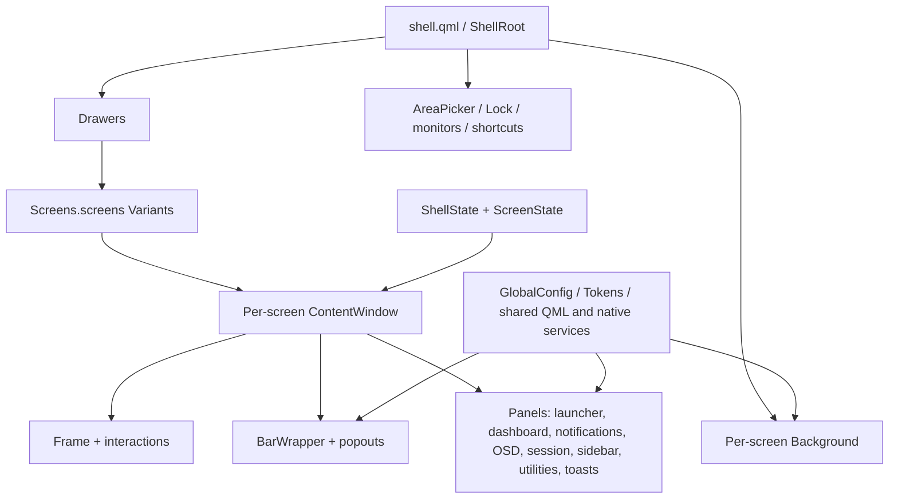

# Caelestia Reference Analysis

## Evidence labels

`Fact` denotes behavior directly observed in the cited reference or active source. `[INFERENCE]` denotes a technical consequence derived from those facts. `Recommendation:` denotes adaptation guidance, not current behavior or a selected visual direction. Complexity ratings describe observed integration breadth, not delivery estimates.

## Architecture and entry points

Fact: `references/repos/caelestia/shell.qml:16-41` is one Quickshell `ShellRoot`. It binds the process-wide `ShellState.shellRoot`, eagerly creates `GSFLoader`, and starts background, drawers, area picker, lock, configuration toasts, shortcuts, battery monitoring, and idle monitoring. `Drawers` expands the enabled screen model into one exclusions object and one drawer content window per screen (`references/repos/caelestia/modules/drawers/Drawers.qml:7-25`; `references/repos/caelestia/services/Screens.qml:6-13`). The drawer content window is the per-screen composition boundary: it coordinates layer-shell focus/input regions and fullscreen behavior, then composes the frame, interaction layer, `Panels`, and bar (`references/repos/caelestia/modules/drawers/ContentWindow.qml:35-79,103-177,251-335`). `Panels` is an `Item` inside that window rather than a set of independent OS windows (`references/repos/caelestia/modules/drawers/Panels.qml:16-155`).

Fact: state has two scopes. `ShellState` owns `Variants` of per-screen `ScreenState` and per-screen component-reference registries, and maps the active Hyprland monitor back to those instances (`references/repos/caelestia/services/ShellState.qml:9-60,62-99`). `ScreenState` persists bar/drawer booleans and dashboard selection/date per screen through Quickshell `PersistentProperties` (`references/repos/caelestia/components/ScreenState.qml:1-18`). Shared QML singletons under `services/` and native `Caelestia*` QML modules own cross-screen backends. Native global configuration and token singletons are JSON-backed and create screen-name-keyed overlay objects (`references/repos/caelestia/plugin/src/Caelestia/Config/config.cpp:29-54,82-109`; `references/repos/caelestia/plugin/src/Caelestia/Config/tokens.cpp:10-54`; `references/repos/caelestia/plugin/src/Caelestia/Config/monitorconfigmanager.cpp:28-64`).

Fact: the compositor contract is Hyprland-specific. Quickshell supplies canonical monitor/workspace/toplevel models, while native `HyprExtras` adds direct runtime-socket access for options, devices, events, and configuration (`references/repos/caelestia/services/Hypr.qml:12-24,79-86,122-151`; `references/repos/caelestia/plugin/src/Caelestia/Internal/hyprextras.cpp:16-53,70-151,176-228`).

Fact: every edge above is established by the bootstrap, per-screen variant, composition, state-registry, and attached-configuration sources cited in the surrounding prose; attached `Config.screen` and `Tokens.screen` are supplied from each styled window's screen name (`references/repos/caelestia/components/containers/StyledWindow.qml:6-14`).

### Active/reference correspondence

| Active anchor | Reference anchor | Shared contract | Observed delta |
|---|---|---|---|
| `shell/shell.qml:16-43` | `references/repos/caelestia/shell.qml:16-42` | Both bind `ShellState.shellRoot` and eagerly compose the same root lifetime features. | Fact: the active root sets `settings.watchFiles: false` rather than reference `true`, and additionally instantiates `VicinaeBridge` (`shell/shell.qml:19-38`; `references/repos/caelestia/shell.qml:19-37`). |
| `shell/services/ShellState.qml:9-99` | `references/repos/caelestia/services/ShellState.qml:9-99` | Both create per-screen `ScreenState` and component registries and resolve the focused Hyprland monitor. | Fact: the inspected definitions are structurally identical at these anchors. |
| `shell/modules/drawers/Panels.qml:16-155` | `references/repos/caelestia/modules/drawers/Panels.qml:16-155` | Both compose notifications, OSD, session, launcher, dashboard, popouts, utilities, toasts, and sidebar inside one per-screen drawer window. | Fact: the inspected definitions are structurally identical at these anchors; active-only behavior enters through consumers and services, not a second panel-window model. |
| Active imports across `shell/components/controls/StyledProgressBar.qml:5-8`, `shell/services/Audio.qml:8-12`, `shell/services/Wallpapers.qml:6-9`, `shell/components/images/CachingImage.qml:1-5`, and `shell/modules/nexus/Nexus.qml:3-7` | Module definitions in `references/repos/caelestia/plugin/src/Caelestia/CMakeLists.txt:1-26`, `references/repos/caelestia/plugin/src/Caelestia/Config/CMakeLists.txt:1-34`, `references/repos/caelestia/plugin/src/Caelestia/Components/CMakeLists.txt:1-9`, `references/repos/caelestia/plugin/src/Caelestia/Internal/CMakeLists.txt:1-13`, `references/repos/caelestia/plugin/src/Caelestia/Models/CMakeLists.txt:1-7`, `references/repos/caelestia/plugin/src/Caelestia/Services/CMakeLists.txt:1-29`, `references/repos/caelestia/plugin/src/Caelestia/Images/CMakeLists.txt:1-10`, and `references/repos/caelestia/plugin/src/Caelestia/Blobs/CMakeLists.txt:1-21` | Active QML consumes the reference-defined `Caelestia`, `Caelestia.Config`, `Caelestia.Components`, `Caelestia.Internal`, `Caelestia.Models`, `Caelestia.Services`, `Caelestia.Images`, and `Caelestia.Blobs` URI contracts; `M3Shapes` is a separately fetched QML module (`references/repos/caelestia/CMakeLists.txt:71-83`). | Fact: active QML adds QML-owned `BarConfig` persistence and services `FanSpeeds`, `Mono`, `Shazam`, `STT`, and `TTS`, plus their active UI/IPC extensions (`shell/services/BarConfig.qml:1-32`; `shell/modules/utilities/cards/Toggles.qml:153-183`; `shell/modules/VicinaeBridge.qml:12-93`). These are active-only services/config extensions, not additions to the imported native plugin ABI. |

## Feature matrix

The High label uses the approved precedence rubric. Each row names the matching High trigger explicitly.

| User-facing feature | Interaction pattern | Relevant source locations | Backend dependencies | Observed complexity |
|---|---|---|---|---|
| Per-screen frame/bar/drawers/popouts | Each enabled screen gets a coordinated layer-shell frame with a bar, drawer panels, edge interactions, exclusions, focus/input masks, and detachable named popouts. | Presentation/entry: `references/repos/caelestia/modules/drawers/Drawers.qml:7-25`; `references/repos/caelestia/modules/drawers/ContentWindow.qml:35-79,140-177,251-335`. Backend/state: `references/repos/caelestia/services/ShellState.qml:11-60`; `references/repos/caelestia/components/ScreenState.qml:3-17`; `references/repos/caelestia/modules/bar/popouts/Wrapper.qml:13-62,80-149`. | Quickshell screens and Wayland layer shell; Hyprland focus/fullscreen; native config and blobs; per-screen state/component registry. | **High** — High trigger: cross-surface/compositor coordination. |
| Launcher providers | A prefix-routed launcher switches among applications, actions, calculator, schemes, Material variants, and wallpaper search; providers execute or apply the selected result. | Presentation/entry: `references/repos/caelestia/modules/launcher/Wrapper.qml:12-41`; `references/repos/caelestia/modules/launcher/AppList.qml:21-55,69-89`; `references/repos/caelestia/modules/launcher/ContentList.qml:21-52,78-109`. Backend/state: `references/repos/caelestia/utils/Searcher.qml:6-54`; `references/repos/caelestia/modules/launcher/services/Apps.qml:23-74`; `references/repos/caelestia/plugin/src/Caelestia/appdb.hpp:11-113`; `references/repos/caelestia/modules/launcher/services/Schemes.qml:28-80`. | Desktop entries; native SQLite-backed `AppDb` and libqalculate; fuzzy/fzf models; configured commands; `caelestia` CLI; wallpaper filesystem model. | **High** — High trigger: substantial custom model. |
| Dashboard/media/lyrics/performance/weather | A per-screen dashboard swipes among panes; media controls and timed lyrics follow MPRIS, performance cards reference-count native probes, and weather refreshes remote forecasts. | Presentation/entry: `references/repos/caelestia/modules/dashboard/Content.qml:16-44,59-109,146-182`; `references/repos/caelestia/modules/dashboard/Media.qml:9-44,125-148`; `references/repos/caelestia/modules/dashboard/Performance.qml:65-138`; `references/repos/caelestia/modules/dashboard/WeatherTab.qml:10-31,75-147`. Backend/state: `references/repos/caelestia/services/Players.qml:1-16,60-183`; `references/repos/caelestia/plugin/src/Caelestia/Services/lyrics.hpp:10-133`; `references/repos/caelestia/services/Weather.qml:29-51,104-225,271-280`. | MPRIS; native lyrics and resource services; PipeWire/Aubio/Cava/libsensors; UPower and procfs; Qt Network requests to geolocation, Open-Meteo, Nominatim, and BigDataCloud APIs. | **High** — High trigger: multiple process/service integrations. |
| Notifications/sidebar/DND/toasts | Notification-server records feed popup and grouped-sidebar views; DND suppresses new popups; a separate native toast stack has fullscreen importance and lifetime policy. | Presentation/entry: `references/repos/caelestia/modules/drawers/Panels.qml:64-74,137-154`; `references/repos/caelestia/modules/sidebar/NotifDock.qml:19-25,27-210`; `references/repos/caelestia/modules/utilities/toasts/Toasts.qml:16-127`. Backend/state: `references/repos/caelestia/services/Notifs.qml:14-48,50-166`; `references/repos/caelestia/plugin/src/Caelestia/toaster.hpp:9-79`; `references/repos/caelestia/plugin/src/Caelestia/toaster.cpp:71-110`. | Quickshell notification server; explicit JSON history and Quickshell persistence; native `Toaster`; per-screen/sidebar/fullscreen coordination. | **High** — High trigger: durable schema and cross-surface coordination. |
| Connectivity/quick controls | Bar popouts, Nexus pages, and utility toggles share Wi-Fi, Ethernet, Bluetooth, audio, settings, game-mode, DND, and VPN state. | Presentation/entry: `references/repos/caelestia/modules/utilities/cards/Toggles.qml:17-36,72-153`; `references/repos/caelestia/modules/bar/popouts/Network.qml:13-155`; `references/repos/caelestia/modules/nexus/pages/BluetoothPage.qml:12-150`. Backend/state: `references/repos/caelestia/services/Nmcli.qml:8-40,186-203,747-778,1489-1595`; `references/repos/caelestia/utils/NetworkConnection.qml:34-132`; `references/repos/caelestia/plugin/src/Caelestia/Config/utilitiesconfig.hpp:10-75`. | `nmcli`/NetworkManager process and monitor output; Quickshell Bluetooth; Audio, Notifs, GameMode, VPN, and Nexus factory singletons. | **High** — High trigger: multiple process/service integrations. |
| Nexus | A named shortcut or IPC creates a floating settings host; the same Nexus can be embedded in a detached bar popout; index-coupled registries route pages and subpages. | Presentation/entry: `references/repos/caelestia/modules/Shortcuts.qml:14-21,138-144`; `references/repos/caelestia/modules/nexus/WindowFactory.qml:10-55`; `references/repos/caelestia/modules/nexus/Nexus.qml:11-110`. Backend/state: `references/repos/caelestia/modules/nexus/NexusState.qml:5-34`; `references/repos/caelestia/modules/nexus/PageRegistry.qml:8-92`; `references/repos/caelestia/modules/nexus/PageCompRegistry.qml:22-202`; `references/repos/caelestia/modules/nexus/Pages.qml:14-57`. | Dynamic window ownership; native blobs/config; shared network, Bluetooth, audio, app, notification, wallpaper, and panel state; positional page/component registries. | **High** — High trigger: cross-surface coordination and substantial custom model. |
| Lock/idle/session lifecycle | A root-owned Wayland session lock creates one lock surface per output; PAM authenticates; idle policies and logind signals lock, unlock, DPMS, or invoke session actions. | Presentation/entry: `references/repos/caelestia/modules/lock/Lock.qml:10-19,41-73`; `references/repos/caelestia/modules/lock/LockSurface.qml:7-69,121-140`; `references/repos/caelestia/modules/session/Content.qml:15-104`. Backend/state: `references/repos/caelestia/modules/lock/Pam.qml:56-173,197-291`; `references/repos/caelestia/modules/IdleMonitors.qml:14-76`; `references/repos/caelestia/plugin/src/Caelestia/Services/sessionmanager.cpp:17-185`. | Wayland session-lock, screencopy, idle monitor, PAM/biometrics, Hyprland DPMS, UPower/MPRIS inhibition, and systemd-logind D-Bus. | **High** — High trigger: security/session ownership. |
| Screenshot/recording | Named screenshot shortcuts open per-screen exclusive selection overlays; capture is cropped in-process then sent to editor/clipboard tools. Recorder controls delegate modes and lifecycle to external processes. | Presentation/entry: `references/repos/caelestia/modules/areapicker/AreaPicker.qml:8-137`; `references/repos/caelestia/modules/areapicker/Picker.qml:9-85,115-213`; `references/repos/caelestia/modules/utilities/cards/Record.qml:27-110,170-280`. Backend/state: `references/repos/caelestia/plugin/src/Caelestia/cutils.cpp:37-99`; `references/repos/caelestia/services/Recorder.qml:7-81`; `references/repos/caelestia/utils/Paths.qml:7-23`. | Wayland screencopy; Hyprland; native Qt image grab/crop; `swappy`, `wl-copy`, `notify-send`; `caelestia` CLI and `gpu-screen-recorder`; filesystem recording state. | **High** — High trigger: multiple process/service integrations. |
| Wallpaper/scheme/background effects | Per-screen background windows cross-fade wallpaper, render optional clock/visualizer effects, and react to wallpaper/scheme selections from Launcher and Nexus. | Presentation/entry: `references/repos/caelestia/modules/background/Background.qml:11-162`; `references/repos/caelestia/modules/nexus/pages/WallpaperAndStyle.qml:10-183`; `references/repos/caelestia/modules/launcher/WallpaperList.qml:39-61`. Backend/state: `references/repos/caelestia/services/Wallpapers.qml:11-109`; `references/repos/caelestia/modules/launcher/services/Schemes.qml:11-79`; `references/repos/caelestia/services/Colours.qml:12-118`; `references/repos/caelestia/plugin/src/Caelestia/Config/backgroundconfig.hpp:7-83`. | `caelestia` CLI and watched state files; native filesystem/image analysis/cache; Hyprland layer rules; Wayland layer shell; Qt effects; Cava/audio visualizer. | **High** — High trigger: multiple process/service integrations and cross-surface/compositor coordination. |

## Backend dependency summary

| Dependency group | Observed dependency and ownership | Enabled feature rows |
|---|---|---|
| Runtime/QML modules | The repository consumes Qt Quick, Quickshell core/Io/Wayland/Hyprland/Bluetooth/Mpris/UPower/Pam APIs throughout its QML; `Drawers` and lock show the window/protocol boundary (`references/repos/caelestia/modules/drawers/ContentWindow.qml:1-32`; `references/repos/caelestia/modules/lock/Lock.qml:1-19`). It also consumes the separately fetched `M3Shapes` module (`references/repos/caelestia/CMakeLists.txt:71-83`). | Frame/chrome, media dashboard, connectivity, lock, screenshot, background effects. |
| Native plugin/library | The repository owns eight Caelestia QML URIs. Core provides `AppDb`, `Qalculator`, requests, toasts, image analysis, and utilities; submodules provide config, components, Hyprland internals, filesystem models, native services, blobs, and image caching (`references/repos/caelestia/plugin/src/Caelestia/CMakeLists.txt:1-26`; `references/repos/caelestia/plugin/src/Caelestia/Services/CMakeLists.txt:1-29`). The build consumes Qt DBus/SQL/Network plus libqalculate, PipeWire, Aubio, Cava, and libsensors (`references/repos/caelestia/plugin/CMakeLists.txt:1-18`). | Launcher, dashboard, notifications/toasts, Nexus, lifecycle, screenshot crop, wallpaper/effects. |
| Compositor/system service | The repository consumes Hyprland through both Quickshell models and owned `HyprExtras`; consumes Wayland layer/session-lock/screencopy/idle protocols, notification ownership, MPRIS, UPower, PAM, Bluetooth, and systemd-logind (`references/repos/caelestia/services/Hypr.qml:12-24,122-151`; `references/repos/caelestia/plugin/src/Caelestia/Services/sessionmanager.cpp:17-58`). | Frame/chrome, dashboard, notifications, connectivity, lock/lifecycle, screenshot, background. |
| External command/daemon | The repository invokes `caelestia` CLI for schemes, wallpapers, and recording; `nmcli` for network state/control; `gpu-screen-recorder` plus `pidof`; and screenshot/editor utilities (`references/repos/caelestia/modules/launcher/services/Schemes.qml:31-79`; `references/repos/caelestia/services/Wallpapers.qml:25-109`; `references/repos/caelestia/services/Recorder.qml:39-70`; `references/repos/caelestia/services/Nmcli.qml:186-203,1489-1519`; `references/repos/caelestia/modules/areapicker/Picker.qml:67-85,153-213`). | Launcher, connectivity, screenshot/recording, wallpaper/scheme/effects. |
| Network API | The repository's native request wrapper consumes IP geolocation, Open-Meteo geocoding/forecast, Nominatim, and BigDataCloud; native lyrics owns local, LRCLIB, and NetEase candidate flows (`references/repos/caelestia/services/Weather.qml:29-51,104-225,271-280`; `references/repos/caelestia/plugin/src/Caelestia/Services/lyrics.hpp:10-133`). | Dashboard/media/lyrics/performance/weather. |
| Persistent/configuration state | Native `GlobalConfig`/tokens own watched JSON and per-monitor overlays; Quickshell owns `ScreenState`/DND persistence; QML `FileView` owns notification history and watched CLI state (`references/repos/caelestia/plugin/src/Caelestia/Config/rootconfig.cpp:91-217,235-306`; `references/repos/caelestia/components/ScreenState.qml:1-18`; `references/repos/caelestia/services/Notifs.qml:50-80,106-131`; `references/repos/caelestia/services/Wallpapers.qml:81-109`). | Every row through config/state gating; especially frame, notifications, launcher app frequency, Nexus, recorder, and wallpaper/scheme. |

## Architectural assumptions and source conflicts

- Fact: window ownership assumes one process-wide bootstrap, filtered Quickshell screens, and per-screen layer-shell/background/session-lock surfaces; active-screen lookup assumes Hyprland monitor mapping (`references/repos/caelestia/shell.qml:16-41`; `references/repos/caelestia/services/Screens.qml:6-13`; `references/repos/caelestia/services/ShellState.qml:16-59`).
- Fact: singleton/config coupling is load-bearing. `GlobalConfig`, tokens, and native services are generated QML modules installed with backing libraries and relative RPATHs, not QML-only helpers (`references/repos/caelestia/plugin/cmake/qml-module.cmake:3-49`). Appearance configuration also reads token values during singleton construction (`references/repos/caelestia/plugin/src/Caelestia/Config/config.cpp:82-101`).
- Fact: service ownership is mixed: the repository owns native service adapters and QML state models, invokes external CLI/process backends, and merely consumes standardized Quickshell objects. For example, QML owns `Nmcli` subprocess state but Bluetooth pages mutate Quickshell Bluetooth objects directly (`references/repos/caelestia/services/Nmcli.qml:8-40,186-203`; `references/repos/caelestia/modules/nexus/pages/BluetoothPage.qml:12-150`).
- Fact: persistence/IPC is split among native watched JSON, Quickshell `PersistentProperties`, explicit `FileView` JSON, named shortcuts, and `IpcHandler`s (`references/repos/caelestia/plugin/src/Caelestia/Config/rootconfig.cpp:91-217`; `references/repos/caelestia/services/Notifs.qml:50-80,106-166`; `references/repos/caelestia/modules/Shortcuts.qml:113-164`).
- Fact: multi-monitor semantics key configuration overlays by `screen.name`; enabled-screen filtering affects both surface construction and state instances (`references/repos/caelestia/plugin/src/Caelestia/Config/monitorconfigmanager.cpp:28-64`; `references/repos/caelestia/services/Screens.qml:6-13`; `references/repos/caelestia/services/ShellState.qml:46-60`).
- Fact: privileged/security actions cross ownership boundaries. QML owns Wayland lock policy and PAM contexts, while native `SessionManager` calls logind for machine/session transitions (`references/repos/caelestia/modules/lock/Pam.qml:56-173`; `references/repos/caelestia/plugin/src/Caelestia/Services/sessionmanager.cpp:98-185`).
- Fact: several integrations parse external output shapes: scheme list/get expects JSON plus ordered lines, `Nmcli` expects escaped-colon records and English error text, and brightness parsing expects fixed command fields (`references/repos/caelestia/modules/launcher/services/Schemes.qml:40-73`; `references/repos/caelestia/services/Nmcli.qml:69-100`; `references/repos/caelestia/services/Brightness.qml:75-91,175-184`).
- Fact: documentation says global-only settings are ignored in monitor overlays, while the native macros/load path warn but proceed to update those members (`references/repos/caelestia/README.md:210-248`; `references/repos/caelestia/plugin/src/Caelestia/Config/configobject.hpp:55-82`; `references/repos/caelestia/plugin/src/Caelestia/Config/configobject.cpp:19-68`). `[INFERENCE]` The documented invariant is not reliably enforced by the observed code path.
- Fact: Nexus navigation lists Updates and Plugins, but the two aligned component slots are placeholders that display “Page under construction”; About separately fixes loaded plugin count to zero and states plugin support is not wired (`references/repos/caelestia/modules/nexus/PageRegistry.qml:45-57`; `references/repos/caelestia/modules/nexus/PageCompRegistry.qml:78-86,169-202`; `references/repos/caelestia/modules/nexus/pages/AboutPage.qml:13-15,145-154`). Updates and Plugins are therefore documented placeholders, not functioning backends.
- Fact: active/reference compatibility is not identity. The active bootstrap disables file watching and adds `VicinaeBridge`; active-only QML services and `BarConfig` extend utility, bar, dashboard, and IPC behavior (`shell/shell.qml:19-38`; `shell/services/BarConfig.qml:1-32`; `shell/modules/utilities/cards/Toggles.qml:153-183`; `shell/modules/VicinaeBridge.qml:12-93`).

## Adaptation assessment

| Concept | Assessment | Reusable active-shell seam | Required work | Risks/conflicts |
|---|---|---|---|---|
| Per-screen composition discipline | Recommendation: Adaptable as an architectural constraint because the active shell already shares the same per-screen state/component composition. | `shell/services/ShellState.qml:9-99`; `shell/modules/drawers/Panels.qml:16-155` | Recommendation: Reimplement any changed presentation within existing `ContentWindow`/`Panels` ownership rather than introducing duplicate top-level windows. | [INFERENCE] Extra window ownership could break exclusion, focus, fullscreen, and active-screen assumptions. |
| Provider-routed search | Recommendation: Adaptable through the active launcher's existing provider and search seams; this is not permission to copy foreign QML wholesale. | `shell/modules/launcher/AppList.qml:21-89`; `shell/utils/Searcher.qml:6-54` | Recommendation: Preserve the active config schema, execution policy, and existing provider contracts when adding or changing a provider. | [INFERENCE] Provider-specific command parsing and native `AppDb`/Qalculator dependencies constrain portability. |
| Shared dashboard integrations | Recommendation: Adaptable pane-by-pane through the active dashboard and service singletons without selecting a visual treatment. | `shell/modules/dashboard/Content.qml:16-182`; `shell/services/Players.qml:1-183` | Recommendation: Keep per-screen selection in `ScreenState` and shared backend ownership in services; preserve lazy/reference-counted service use. | [INFERENCE] Moving backend state into delegates would duplicate polling/network work across screens. |
| Notification and toast separation | Recommendation: Preserve separate notification-history/DND and transient-toast ownership if adapting interaction behavior. | `shell/services/Notifs.qml:14-166`; `shell/modules/utilities/toasts/Toasts.qml:16-127` | Recommendation: Route changes through existing popup, sidebar, and toaster policies and retain persistence semantics. | [INFERENCE] Conflating DND with toasts would change the observed contract that DND suppresses notification popups but can itself produce a toast. |
| Nexus settings host | Recommendation: Adaptable through the existing factory, embedded popout, state, and page registries, but placeholder pages should remain explicitly incomplete until real backends exist. | `shell/modules/nexus/WindowFactory.qml:10-55`; `shell/modules/nexus/PageCompRegistry.qml:22-202` | Recommendation: Add a page only with a matching navigation entry, component slot, state contract, and backend; treat Updates and Plugins as placeholders today. | [INFERENCE] Positional page/component coupling can silently route to the wrong page when only one registry changes. |
| Lifecycle and capture flows | Recommendation: Adapt only through existing lock, idle, area-picker, recorder, and session-manager seams; do not bypass their ownership boundaries. | `shell/modules/lock/Lock.qml:10-73`; `shell/modules/IdleMonitors.qml:14-76`; `shell/modules/areapicker/AreaPicker.qml:8-137`; `shell/services/Recorder.qml:7-81` | Recommendation: Preserve PAM/session-lock sequencing and verify every external command/system-service contract when reimplementing behavior. | [INFERENCE] These flows cross security, compositor, and process boundaries; a visually local change can alter authentication, capture, or machine-session behavior. |
| Native module dependency | Recommendation: Treat imported Caelestia modules and `M3Shapes` as runtime ABI/deployment requirements, not source snippets to transplant. | `shell/components/controls/StyledProgressBar.qml:5-8`; `shell/services/Audio.qml:8-12`; `shell/modules/nexus/Nexus.qml:3-7` | Recommendation: Reuse installed module APIs where the active tree already depends on them; rebuild/package native modules only for intentional ABI changes. | [INFERENCE] Copying QML without matching URI plugins, backing libraries, versions, and RPATH deployment will fail at load time. |
| Active-only extensions | Recommendation: Preserve the active fork's explicit extensions when reconciling reference concepts, unless a separate request removes them. | `shell/shell.qml:19-38`; `shell/services/BarConfig.qml:1-32`; `shell/modules/VicinaeBridge.qml:12-93`; `shell/modules/utilities/cards/Toggles.qml:153-183` | Recommendation: Integrate through active `BarConfig`, service singletons, and Vicinae IPC rather than replacing them with reference defaults. | [INFERENCE] A blind reference refresh would restore `settings.watchFiles: true`, omit `VicinaeBridge`, and lose active-only service/config behavior. |
