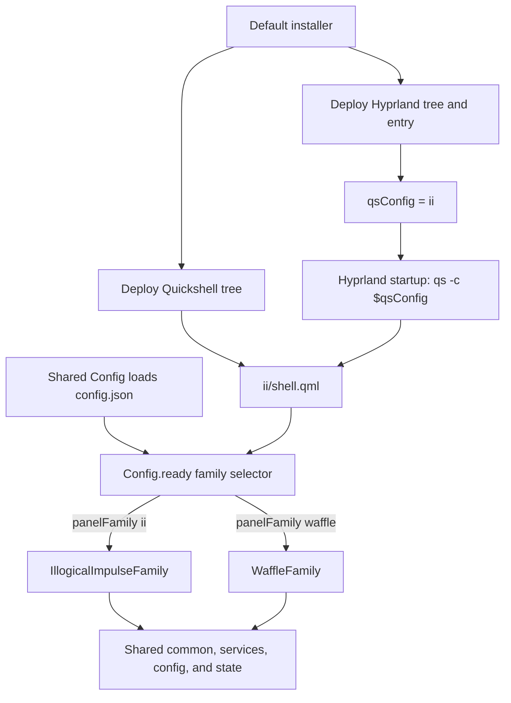

# Illogical Impulse Reference Analysis

## Evidence labels

`Fact:` denotes behavior directly observed in the cited reference or active source. `[INFERENCE]` denotes a technical consequence derived from cited facts rather than behavior directly asserted by source. `Recommendation:` denotes adaptation guidance, not current behavior, a selected visual direction, a roadmap, or a priority. Complexity ratings describe observed architecture and integration breadth rather than implementation effort.

## Architecture and entry points

Fact: the default `./setup install` path reaches the file-deployment stage and, unless the experimental file mode is selected, uses the legacy deployment (`references/repos/illogical-impulse/setup:78-88`; `references/repos/illogical-impulse/sdata/subcmd-install/3.files.sh:215-224`). That default stage synchronizes the complete Quickshell configuration tree to `$XDG_CONFIG_HOME/quickshell`, the Hyprland module tree to `$XDG_CONFIG_HOME/hypr/hyprland`, and the Hyprland entry file to `$XDG_CONFIG_HOME/hypr/hyprland.lua` (`references/repos/illogical-impulse/sdata/subcmd-install/3.files-legacy.sh:23-28,46-69`). The experimental manifest independently names the same two deployment roots, including `dots/.config/quickshell/ii` at `$XDG_CONFIG_HOME/quickshell/ii` (`references/repos/illogical-impulse/sdata/subcmd-install/3.files-exp.yaml:14-18,45-59`). Installation therefore deploys both Quickshell and Hyprland configuration, including both panel-family implementations; it does not select one family at install time.

Fact: the installed Hyprland entry loads the execution and keybinding modules (`references/repos/illogical-impulse/dots/.config/hypr/hyprland.lua:14-19`). The variables module defines `qsConfig=ii`, and the Hyprland startup callback launches `qs -c $qsConfig` (`references/repos/illogical-impulse/dots/.config/hypr/hyprland/variables.lua:1-5`; `references/repos/illogical-impulse/dots/.config/hypr/hyprland/execs.lua:1-7`). Repository development instructions identify `qs -c ii` with the installed `~/.config/quickshell/ii` configuration (`references/repos/illogical-impulse/.github/CONTRIBUTING.md:60-63`); the operative root in that configuration is `references/repos/illogical-impulse/dots/.config/quickshell/ii/shell.qml:8-17`.

Fact: `ii/shell.qml` is a `ShellRoot` importing `modules/common`, `services`, and `panelFamilies`; at completion it starts shared theme, night-light, first-run, conflict, clipboard, wallpaper, and update services (`references/repos/illogical-impulse/dots/.config/quickshell/ii/shell.qml:8-32`). Shared `Config` watches and writes `illogical-impulse/config.json`, sets `ready` after loading, creates defaults when the file is absent, and defaults `panelFamily` to `ii` (`references/repos/illogical-impulse/dots/.config/quickshell/ii/modules/common/Config.qml:9-13,38-81`; `references/repos/illogical-impulse/dots/.config/quickshell/ii/modules/common/Directories.qml:10-18,33-35`). Once `Config.ready` is true, the root's mutually exclusive family loaders select `IllogicalImpulseFamily` for `ii` or `WaffleFamily` for `waffle`; IPC target `panelFamily` and global shortcut `panelFamilyCycle` mutate that same persisted selector (`references/repos/illogical-impulse/dots/.config/quickshell/ii/shell.qml:36-75`). Inner family components are also gated by the shared `PanelLoader` and `Config.ready` (`references/repos/illogical-impulse/dots/.config/quickshell/ii/panelFamilies/PanelLoader.qml:1-9`).

Fact: the II family composes its bar, dock, overview, sidebars, notifications, lock, overlays, capture, session, and related surfaces, while the Waffle family composes a different set of Waffle roots and explicitly reuses II cheatsheet, on-screen keyboard, overlay, screen translator, and wallpaper-selector fallbacks (`references/repos/illogical-impulse/dots/.config/quickshell/ii/panelFamilies/IllogicalImpulseFamily.qml:1-47`; `references/repos/illogical-impulse/dots/.config/quickshell/ii/panelFamilies/WaffleFamily.qml:1-46`). Both roots import the same common module, and representative bars consume the same shared services, `Config`, `GlobalStates`, and Quickshell screen model (`references/repos/illogical-impulse/dots/.config/quickshell/ii/panelFamilies/IllogicalImpulseFamily.qml:1-5`; `references/repos/illogical-impulse/dots/.config/quickshell/ii/panelFamilies/WaffleFamily.qml:1-5`; `references/repos/illogical-impulse/dots/.config/quickshell/ii/modules/ii/bar/Bar.qml:1-32`; `references/repos/illogical-impulse/dots/.config/quickshell/ii/modules/waffle/bar/WaffleBar.qml:1-30`).

[INFERENCE] Family choice is a runtime, persisted presentation-composition preference rather than an installer choice: deployment installs both implementations, while the watched config adapter and root selector determine which family is active (`references/repos/illogical-impulse/sdata/subcmd-install/3.files-legacy.sh:23-28,46-69`; `references/repos/illogical-impulse/dots/.config/quickshell/ii/modules/common/Config.qml:38-81`; `references/repos/illogical-impulse/dots/.config/quickshell/ii/shell.qml:36-75`).

## Feature matrix

The High and Medium labels use explicit rubric triggers. Every row cites both a presentation or entry surface and its backend or state owner.

| User-facing feature | Interaction pattern | Relevant source locations | Backend dependencies | Observed complexity |
|---|---|---|---|---|
| Shell chrome/families/bar/workspaces/dock/tray | A persisted selector replaces the active top-level family; the II family creates per-screen layer-shell bars and docks, compositor-backed workspaces, and pinned/overflow tray interaction. | Presentation/entry: `references/repos/illogical-impulse/dots/.config/quickshell/ii/shell.qml:36-75`; `references/repos/illogical-impulse/dots/.config/quickshell/ii/panelFamilies/IllogicalImpulseFamily.qml:26-46`; `references/repos/illogical-impulse/dots/.config/quickshell/ii/modules/ii/bar/Bar.qml:14-67,69-134`; `references/repos/illogical-impulse/dots/.config/quickshell/ii/modules/ii/dock/Dock.qml:14-38,89-136`. Backend/state: `references/repos/illogical-impulse/dots/.config/quickshell/ii/GlobalStates.qml:11-31`; `references/repos/illogical-impulse/dots/.config/quickshell/ii/services/TaskbarApps.qml:10-56`; `references/repos/illogical-impulse/dots/.config/quickshell/ii/services/TrayService.qml:9-52`. | Quickshell screens, Wayland layer shell and input regions; Hyprland monitor/workspace dispatch; toplevel/screencopy; SystemTray; shared config, state, and focus-grab services. | **High** — High trigger: cross-surface/compositor coordination. |
| Overview and provider-routed launcher/search/clipboard/emoji/math/actions | A focused overview combines workspace/toplevel previews with prefix-routed results for applications, actions, clipboard, emoji, calculator, commands, and web search. | Presentation/entry: `references/repos/illogical-impulse/dots/.config/quickshell/ii/modules/ii/overview/Overview.qml:18-102,106-201`; `references/repos/illogical-impulse/dots/.config/quickshell/ii/modules/ii/overview/SearchWidget.qml:18-38,145-216`; `references/repos/illogical-impulse/dots/.config/quickshell/ii/modules/ii/overview/OverviewWidget.qml:14-49,90-218`. Backend/state: `references/repos/illogical-impulse/dots/.config/quickshell/ii/services/LauncherSearch.qml:32-58,145-350`; `references/repos/illogical-impulse/dots/.config/quickshell/ii/services/AppSearch.qml:39-139`; `references/repos/illogical-impulse/dots/.config/quickshell/ii/services/HyprlandData.qml:13-153`. | DesktopEntries, ToplevelManager, ScreencopyView and Hyprland; fuzzy helpers; cliphist and emoji models; `qalc`; filesystem action scripts; detached shell commands and browser URL handling. | **High** — High trigger: substantial custom model. |
| Right control center | A right drawer presents quick toggles, sliders, notifications, and lazy Wi-Fi, Bluetooth, audio, and night-light dialogs; opening it owns focus and read/popup transitions. | Presentation/entry: `references/repos/illogical-impulse/dots/.config/quickshell/ii/modules/ii/sidebarRight/SidebarRight.qml:13-66,70-109`; `references/repos/illogical-impulse/dots/.config/quickshell/ii/modules/ii/sidebarRight/SidebarRightContent.qml:20-202,247-298`; `references/repos/illogical-impulse/dots/.config/quickshell/ii/modules/ii/sidebarRight/QuickSliders.qml:12-99`. Backend/state: `references/repos/illogical-impulse/dots/.config/quickshell/ii/GlobalStates.qml:14-16,34-39`; `references/repos/illogical-impulse/dots/.config/quickshell/ii/services/Audio.qml:10-108`; `references/repos/illogical-impulse/dots/.config/quickshell/ii/services/Network.qml:12-102`; `references/repos/illogical-impulse/dots/.config/quickshell/ii/services/Brightness.qml:14-130`. | PipeWire, Bluetooth, UPower and Hyprland; NetworkManager/`nmcli`; `brightnessctl`/`ddcutil`; Hyprsunset; notification state; configured external control applications. | **High** — High trigger: multiple process/service integrations. |
| Detachable AI/translator/image sidebar | One content object can be reparented between an anchored layer-shell sidebar and a floating window; pages provide AI chat, translation, and image-oriented services. | Presentation/entry: `references/repos/illogical-impulse/dots/.config/quickshell/ii/modules/ii/sidebarLeft/SidebarLeft.qml:12-20,51-80,83-199`; `references/repos/illogical-impulse/dots/.config/quickshell/ii/modules/ii/sidebarLeft/SidebarLeftContent.qml:10-21,44-106`; `references/repos/illogical-impulse/dots/.config/quickshell/ii/modules/ii/sidebarLeft/AiChat.qml:40-145,204-216`. Backend/state: `references/repos/illogical-impulse/dots/.config/quickshell/ii/services/Ai.qml:18-49,81-300,358-442,535-548,576-829`; `references/repos/illogical-impulse/dots/.config/quickshell/ii/services/KeyringStorage.qml:10-18,27-108`; `references/repos/illogical-impulse/dots/.config/quickshell/ii/services/Booru.qml:20-70,95-223,300-450`. | Remote Gemini/Mistral/OpenAI-format APIs and local Ollama; curl/generated shell requests; Secret Service; filesystem chats/prompts; image-provider APIs; clipboard and file utilities. | **High** — High trigger: multiple process/service integrations. |
| Notifications | A notification-server owner feeds timed popups and grouped history; right-sidebar opening inhibits popups, marks records read, and shares dismissal/action delegates. | Presentation/entry: `references/repos/illogical-impulse/dots/.config/quickshell/ii/modules/ii/notificationPopup/NotificationPopup.qml:12-42`; `references/repos/illogical-impulse/dots/.config/quickshell/ii/modules/ii/sidebarRight/notifications/NotificationList.qml:10-63`; `references/repos/illogical-impulse/dots/.config/quickshell/ii/modules/common/widgets/NotificationListView.qml:14-24`. Backend/state: `references/repos/illogical-impulse/dots/.config/quickshell/ii/services/Notifications.qml:17-72,76-184,188-306`; `references/repos/illogical-impulse/dots/.config/quickshell/ii/GlobalStates.qml:34-39`; `references/repos/illogical-impulse/dots/.config/quickshell/ii/modules/common/Directories.qml:38-40`. | Quickshell NotificationServer and live action objects; JSON history; timers; Hyprland focused-monitor selection; sidebar and lock policy. | **High** — High trigger: durable schema and cross-surface coordination. |
| Media controls | A lazy popup follows active MPRIS players, offers transport and seek controls, shows cached/quantized cover art, and runs a visualizer only while open. | Presentation/entry: `references/repos/illogical-impulse/dots/.config/quickshell/ii/modules/ii/mediaControls/MediaControls.qml:15-67,73-143,185-233`; `references/repos/illogical-impulse/dots/.config/quickshell/ii/modules/ii/mediaControls/PlayerControl.qml:15-151,153-288`; `references/repos/illogical-impulse/dots/.config/quickshell/ii/modules/ii/bar/Media.qml:12-84`. Backend/state: `references/repos/illogical-impulse/dots/.config/quickshell/ii/services/MprisController.qml:17-191`; `references/repos/illogical-impulse/dots/.config/quickshell/ii/GlobalStates.qml:14-17`. | Quickshell MPRIS objects; Cava subprocess; curl; cover cache; ColorQuantizer; focus, layer-shell, and bar-placement state. | **Medium** — Medium trigger: several coordinated QML/service files or one external integration. |
| Wallpaper/generated theming | Per-screen static/video backgrounds and a browsable selector apply a chosen or random wallpaper, then regenerate and hot-load the shell palette. | Presentation/entry: `references/repos/illogical-impulse/dots/.config/quickshell/ii/modules/ii/background/Background.qml:21-103,130-220`; `references/repos/illogical-impulse/dots/.config/quickshell/ii/modules/ii/wallpaperSelector/WallpaperSelector.qml:13-94`; `references/repos/illogical-impulse/dots/.config/quickshell/ii/modules/ii/wallpaperSelector/WallpaperSelectorContent.qml:12-105,110-160`. Backend/state: `references/repos/illogical-impulse/dots/.config/quickshell/ii/services/Wallpapers.qml:15-178`; `references/repos/illogical-impulse/dots/.config/quickshell/ii/scripts/colors/switchwall.sh:169-315`; `references/repos/illogical-impulse/dots/.config/quickshell/ii/services/MaterialThemeLoader.qml:15-28,42-91`. | Folder and thumbnail models; ImageMagick; `hyprctl`, `jq`, `bc`, Matugen and Python; project scripts; mpvpaper/ffmpeg; watched generated-color state. | **High** — High trigger: multiple process/service integrations and cross-surface/compositor coordination. |
| Region/OCR/search/recording/screen translation | Per-screen selection overlays support normal/frozen and region/window/layer targeting, then route captures to clipboard, editor, remote image search, OCR, recording, or translated text overlays. | Presentation/entry: `references/repos/illogical-impulse/dots/.config/quickshell/ii/modules/ii/regionSelector/RegionSelector.qml:11-116`; `references/repos/illogical-impulse/dots/.config/quickshell/ii/modules/ii/regionSelector/RegionSelection.qml:23-31,46-181,198-370`; `references/repos/illogical-impulse/dots/.config/quickshell/ii/modules/ii/screenTranslator/ScreenTranslator.qml:10-54`; `references/repos/illogical-impulse/dots/.config/quickshell/ii/modules/ii/screenTranslator/ScreenTextOverlay.qml:59-212`. Backend/state: `references/repos/illogical-impulse/dots/.config/quickshell/ii/modules/common/utils/ScreenshotAction.qml:16-85`; `references/repos/illogical-impulse/dots/.config/quickshell/ii/services/GoogleCloud.qml:8-108`; `references/repos/illogical-impulse/dots/.config/quickshell/ii/GlobalStates.qml:21-28`. | Wayland screencopy and Hyprland geometry; ImageMagick, wl-clipboard, satty/swappy, curl/jq/xdg-open, Tesseract and recording scripts; Google Vision/Translate and keyring credentials. | **High** — High trigger: multiple process/service integrations. |
| Overlay widget canvas | An overlay remains present while open or while widgets are pinned; draggable/resizable widgets persist geometry, pin and click-through state, while input masks follow live clickable regions. | Presentation/entry: `references/repos/illogical-impulse/dots/.config/quickshell/ii/modules/ii/overlay/Overlay.qml:12-89`; `references/repos/illogical-impulse/dots/.config/quickshell/ii/modules/ii/overlay/OverlayContent.qml:13-65`; `references/repos/illogical-impulse/dots/.config/quickshell/ii/modules/ii/overlay/StyledOverlayWidget.qml:12-111,165-185`. Backend/state: `references/repos/illogical-impulse/dots/.config/quickshell/ii/modules/ii/overlay/OverlayContext.qml:8-41`; `references/repos/illogical-impulse/dots/.config/quickshell/ii/modules/common/Persistent.qml:69-140`; `references/repos/illogical-impulse/dots/.config/quickshell/ii/GlobalStates.qml:21-24`. | Quickshell layer-shell and input regions; persistent JSON; widget registry/canvas; feature services consumed by individual widget delegates. | **High** — High trigger: durable schema and cross-surface/compositor coordination. |
| Lock/session/OSD/OSK/polkit | A Wayland session lock coordinates per-screen visuals and PAM; separate overlays expose session actions, audio/brightness/gamma feedback, virtual input, and automatic polkit authentication. | Presentation/entry: `references/repos/illogical-impulse/dots/.config/quickshell/ii/modules/common/panels/lock/LockScreen.qml:89-154`; `references/repos/illogical-impulse/dots/.config/quickshell/ii/modules/ii/sessionScreen/SessionScreen.qml:13-53,92-222,287-338`; `references/repos/illogical-impulse/dots/.config/quickshell/ii/modules/ii/onScreenDisplay/OnScreenDisplay.qml:14-89,91-223`; `references/repos/illogical-impulse/dots/.config/quickshell/ii/modules/ii/onScreenKeyboard/OnScreenKeyboard.qml:13-166`; `references/repos/illogical-impulse/dots/.config/quickshell/ii/modules/common/widgets/FullscreenPolkitWindow.qml:11-42`. Backend/state: `references/repos/illogical-impulse/dots/.config/quickshell/ii/modules/common/panels/lock/LockContext.qml:1-24,30-137`; `references/repos/illogical-impulse/dots/.config/quickshell/ii/modules/common/functions/Session.qml:8-56`; `references/repos/illogical-impulse/dots/.config/quickshell/ii/services/PolkitService.qml:1-47`; `references/repos/illogical-impulse/dots/.config/quickshell/ii/GlobalStates.qml:14-29`. | Wayland session-lock, PAM/fingerprint and Hyprland; loginctl/systemd and configured session commands; Audio/Brightness/Hyprsunset; ydotool; Quickshell PolkitAgent. | **High** — High trigger: security/session ownership. |
| Settings/welcome | Separate application windows edit the shared watched config; first-run state can apply a default wallpaper and launch welcome, while settings exposes eight configuration pages. | Presentation/entry: `references/repos/illogical-impulse/dots/.config/quickshell/ii/settings.qml:8-76,95-113,236-276`; `references/repos/illogical-impulse/dots/.config/quickshell/ii/welcome.qml:8-59,145-243,344-383`; `references/repos/illogical-impulse/dots/.config/hypr/hyprland/keybinds.lua:35-38,350-355`. Backend/state: `references/repos/illogical-impulse/dots/.config/quickshell/ii/services/FirstRunExperience.qml:8-45`; `references/repos/illogical-impulse/dots/.config/quickshell/ii/modules/common/Config.qml:7-69`; `references/repos/illogical-impulse/dots/.config/quickshell/ii/services/MaterialThemeLoader.qml:42-70`. | Qt/Quickshell ApplicationWindow; watched config and first-run marker; `qs -p`; notification, wallpaper, and translation processes. | **Medium** — Medium trigger: several coordinated QML/service files or one external integration. |
| Waffle alternate family | Runtime cycling replaces the II family with Waffle-native action center, bar, background, lock, notification, OSD, polkit, snip, start, session, and task-view roots while retaining named II fallbacks. | Presentation/entry: `references/repos/illogical-impulse/dots/.config/quickshell/ii/panelFamilies/WaffleFamily.qml:1-46`; `references/repos/illogical-impulse/dots/.config/quickshell/ii/modules/waffle/startMenu/WaffleStartMenu.qml:14-152`; `references/repos/illogical-impulse/dots/.config/quickshell/ii/modules/waffle/taskView/WaffleTaskView.qml:15-104`. Backend/state: `references/repos/illogical-impulse/dots/.config/quickshell/ii/shell.qml:36-75`; `references/repos/illogical-impulse/dots/.config/quickshell/ii/modules/common/Config.qml:7-69,81,611-632`; `references/repos/illogical-impulse/dots/.config/quickshell/ii/GlobalStates.qml:10-31`. | The same Quickshell, compositor, config, global state, launcher, notification, audio, brightness, lock/PAM, polkit, and session backends as II; Waffle-local presentation controls plus II fallback modules. | **High** — High trigger: cross-surface/compositor coordination. |

## Backend dependency summary

Ownership terms are literal: **owns** means the repository creates or supervises the runtime object, model, file, or child process; **invokes** means it issues a command or request without providing the underlying facility; **consumes** means it binds to a host, library, protocol, or Quickshell-supplied service. Enabled feature rows below use the matrix order 1–12.

| Dependency group | Observed dependency and repository relationship | Enabled feature rows |
|---|---|---|
| Runtime/QML | The repository **consumes** Qt Quick and Quickshell core, Io, Wayland, Hyprland, PipeWire, Bluetooth, MPRIS, UPower, PAM, Polkit, notification, positioning, multimedia, virtual-keyboard, Kirigami, and syntax APIs; `ShellRoot` **owns** the process bootstrap and family lifetime (`references/repos/illogical-impulse/dots/.config/quickshell/ii/shell.qml:9-76`; `references/repos/illogical-impulse/sdata/dist-arch/illogical-impulse-quickshell-git/PKGBUILD:13-55`). | 1–12. |
| Native/plugin/library | The repository **consumes** packaged Quickshell/Qt, PipeWire, DRM, Wayland, XCB, Mesa, image, positioning, and multimedia libraries (`references/repos/illogical-impulse/sdata/dist-arch/illogical-impulse-quickshell-git/PKGBUILD:17-55`). It packages and **invokes** the separately built MicroTeX `/opt/MicroTeX/LaTeX` executable for cached SVG rendering rather than exposing it as an in-process project QML service (`references/repos/illogical-impulse/sdata/dist-arch/illogical-impulse-microtex-git/PKGBUILD:1-41`; `references/repos/illogical-impulse/dots/.config/quickshell/ii/services/LatexRenderer.qml:8-79`). | 2, 3, 6, 10. |
| Compositor/system | The repository **consumes** Hyprland models/events plus `hyprctl`, Wayland layer/session-lock/screencopy/idle protocols, PipeWire, UPower, BlueZ, MPRIS, PAM, systemd/logind, NetworkManager, Secret Service, and polkit (`references/repos/illogical-impulse/dots/.config/quickshell/ii/services/HyprlandData.qml:4-8,21-164`; `references/repos/illogical-impulse/dots/.config/quickshell/ii/services/Audio.qml:14-82`; `references/repos/illogical-impulse/dots/.config/quickshell/ii/modules/common/panels/lock/LockContext.qml:1-8,54-139`). It **owns** the shell-side NotificationServer, PolkitAgent interaction, and IdleInhibitor objects (`references/repos/illogical-impulse/dots/.config/quickshell/ii/services/Notifications.qml:1-13,149-184`; `references/repos/illogical-impulse/dots/.config/quickshell/ii/services/PolkitService.qml:1-47`; `references/repos/illogical-impulse/dots/.config/quickshell/ii/services/Idle.qml:1-53`). | 1, 3, 5, 6, 7, 8, 9, 10, 12. |
| External command/daemon | At session startup the repository **owns/supervises** `qs`, the GeoClue helper, keyring daemon, hypridle, EasyEffects service mode, and two `wl-paste --watch`/cliphist pipelines (`references/repos/illogical-impulse/dots/.config/hypr/hyprland/execs.lua:1-25`). At runtime it **owns** `nmcli monitor` and loader-scoped Cava children, and **invokes** `hyprctl`, nmcli, brightnessctl, ddcutil, Grim/ImageMagick, cliphist/wl-clipboard/ydotool, qalc, curl, jq, browser and terminal commands, OCR/recording scripts, session commands, Matugen, Python, mpvpaper, and ffmpeg (`references/repos/illogical-impulse/dots/.config/quickshell/ii/services/Network.qml:51-169`; `references/repos/illogical-impulse/dots/.config/quickshell/ii/modules/ii/mediaControls/MediaControls.qml:56-67`; `references/repos/illogical-impulse/dots/.config/quickshell/ii/modules/common/utils/ScreenshotAction.qml:28-85`; `references/repos/illogical-impulse/dots/.config/quickshell/ii/scripts/colors/switchwall.sh:169-315`). | 1–4, 6–11. |
| Network API | The repository **invokes** Gemini and Mistral endpoints, OpenAI-format endpoints, local Ollama, Google resumable upload, Google Cloud Vision/Translate, multiple image-provider APIs, `wttr.in`, and the captive-portal check; it owns request construction and response models but not those services (`references/repos/illogical-impulse/dots/.config/quickshell/ii/services/Ai.qml:249-385,576-704`; `references/repos/illogical-impulse/dots/.config/quickshell/ii/services/Booru.qml:20-70,95-223,300-450`; `references/repos/illogical-impulse/dots/.config/quickshell/ii/services/Weather.qml:76-155`; `references/repos/illogical-impulse/dots/.config/quickshell/ii/services/GoogleCloud.qml:35-108`). | 4, 7, 8, 11. |
| Persistent/config state | The repository **owns** watched typed configuration at the XDG config path, watched runtime state under the XDG state path, Secret Service JSON records, notification history, overlay geometry, todo/notes, AI chats, generated theme state, and caches/temporary paths (`references/repos/illogical-impulse/dots/.config/quickshell/ii/modules/common/Config.qml:8-81`; `references/repos/illogical-impulse/dots/.config/quickshell/ii/modules/common/Persistent.qml:7-140`; `references/repos/illogical-impulse/dots/.config/quickshell/ii/services/KeyringStorage.qml:8-18,68-121`; `references/repos/illogical-impulse/dots/.config/quickshell/ii/modules/common/Directories.qml:27-64`). The shell **consumes** external edits through watched files and exposes state mutation through IPC/global shortcuts (`references/repos/illogical-impulse/dots/.config/quickshell/ii/shell.qml:61-75`). | 1–12. |

## Architectural assumptions and source conflicts

- Fact: window and compositor ownership are family-scoped but distributed across independently loaded `PanelWindow`s. Bars and docks each expand screens and own layer-shell exclusion/input behavior, while the root replaces the entire active family (`references/repos/illogical-impulse/dots/.config/quickshell/ii/shell.qml:44-58`; `references/repos/illogical-impulse/dots/.config/quickshell/ii/modules/ii/bar/Bar.qml:14-67,69-134`; `references/repos/illogical-impulse/dots/.config/quickshell/ii/modules/ii/dock/Dock.qml:14-38,89-136`).
- Fact: singleton and configuration coupling are load-bearing. Family loaders wait for one shared `Config.ready`; family selection, feature schemas, and service state are process-wide, while `Persistent` writes a separate runtime-state file (`references/repos/illogical-impulse/dots/.config/quickshell/ii/shell.qml:36-58`; `references/repos/illogical-impulse/dots/.config/quickshell/ii/modules/common/Config.qml:38-81`; `references/repos/illogical-impulse/dots/.config/quickshell/ii/modules/common/Persistent.qml:7-68`).
- Fact: service and daemon ownership is mixed. The shell owns notification and polkit interaction objects and supervises `nmcli monitor` and conditional Cava, consumes PipeWire/BlueZ/UPower/MPRIS/Hyprland objects, and the Hyprland session starts keyring, idle, EasyEffects, GeoClue, and clipboard-watcher daemons (`references/repos/illogical-impulse/dots/.config/quickshell/ii/services/Notifications.qml:1-13,149-184`; `references/repos/illogical-impulse/dots/.config/quickshell/ii/services/PolkitService.qml:1-47`; `references/repos/illogical-impulse/dots/.config/quickshell/ii/services/Network.qml:156-169`; `references/repos/illogical-impulse/dots/.config/hypr/hyprland/execs.lua:1-25`).
- Fact: persistence and IPC are split among watched `config.json`, watched `states.json`, explicit service JSON, Secret Service, named global shortcuts, and `IpcHandler` endpoints (`references/repos/illogical-impulse/dots/.config/quickshell/ii/modules/common/Config.qml:38-81`; `references/repos/illogical-impulse/dots/.config/quickshell/ii/modules/common/Persistent.qml:7-68`; `references/repos/illogical-impulse/dots/.config/quickshell/ii/services/Notifications.qml:255-302`; `references/repos/illogical-impulse/dots/.config/quickshell/ii/services/KeyringStorage.qml:68-121`; `references/repos/illogical-impulse/dots/.config/quickshell/ii/shell.qml:61-75`).
- Fact: multi-monitor behavior assumes exact output-name joins among `Quickshell.screens`, `Hyprland.focusedMonitor.name`, configured output names, and DDC connector normalization. Some surfaces expand every Quickshell screen, the bar alone applies `screenList`, and focused popup/OSD/session/translator actions resolve through the focused monitor name (`references/repos/illogical-impulse/dots/.config/quickshell/ii/modules/ii/bar/Bar.qml:19-24`; `references/repos/illogical-impulse/dots/.config/quickshell/ii/modules/ii/background/Background.qml:21-36,74-77`; `references/repos/illogical-impulse/dots/.config/quickshell/ii/modules/ii/notificationPopup/NotificationPopup.qml:14-20`; `references/repos/illogical-impulse/dots/.config/quickshell/ii/services/Brightness.qml:20-68`). [INFERENCE] Output renaming, incomplete compositor data, or a hotplug race can leave a focused-screen join unresolved or interrupt the lock workspace transition (`references/repos/illogical-impulse/dots/.config/quickshell/ii/modules/ii/lock/Lock.qml:11-75`).
- Fact: security and privileged actions cross several authorities. Lock uses Wayland session-lock, PAM and optional fingerprint/hyprlock paths; session actions invoke loginctl/systemd/Hyprland commands; polkit requests activate the repository-owned agent UI (`references/repos/illogical-impulse/dots/.config/quickshell/ii/modules/common/panels/lock/LockContext.qml:1-8,30-137`; `references/repos/illogical-impulse/dots/.config/quickshell/ii/modules/common/functions/Session.qml:8-56`; `references/repos/illogical-impulse/dots/.config/quickshell/ii/services/PolkitService.qml:1-47`). AI-proposed shell commands require explicit approval, while AI-proposed config mutation calls the dynamic setter without a parallel approval step (`references/repos/illogical-impulse/dots/.config/quickshell/ii/services/Ai.qml:749-835`; `references/repos/illogical-impulse/dots/.config/quickshell/ii/modules/common/Config.qml:15-37`).
- Fact: external parsing assumes specific producer formats. Hyprland command results are parsed as JSON; Network forces C locale and parses English nmcli states plus escaped-colon rows; brightness derives connector/bus and values from fixed command fields; persisted notification and todo JSON do not show corruption recovery at their parse sites (`references/repos/illogical-impulse/dots/.config/quickshell/ii/services/HyprlandData.qml:96-164`; `references/repos/illogical-impulse/dots/.config/quickshell/ii/services/Network.qml:103-125,172-323`; `references/repos/illogical-impulse/dots/.config/quickshell/ii/services/Brightness.qml:71-84,122-141`; `references/repos/illogical-impulse/dots/.config/quickshell/ii/services/Notifications.qml:267-302`; `references/repos/illogical-impulse/dots/.config/quickshell/ii/services/Todo.qml:68-83`).
- Fact: command and secret boundaries are not uniform. AI API values use Secret Service, but generated curl payloads use a fixed temporary script; launcher command mode intentionally invokes user input through `bash -c`; weather interpolates its normalized city into a shell command; chats, notification history, and notes remain ordinary state/cache files (`references/repos/illogical-impulse/dots/.config/quickshell/ii/services/KeyringStorage.qml:8-18,68-121`; `references/repos/illogical-impulse/dots/.config/quickshell/ii/services/Ai.qml:599-669,837-891`; `references/repos/illogical-impulse/dots/.config/quickshell/ii/services/LauncherSearch.qml:247-291`; `references/repos/illogical-impulse/dots/.config/quickshell/ii/services/Weather.qml:76-109`; `references/repos/illogical-impulse/dots/.config/quickshell/ii/modules/common/Directories.qml:33-50`). [INFERENCE] Adaptations crossing these boundaries inherit process-inspection, shell-quoting, temporary-file, and plaintext-state exposure unless they preserve or deliberately replace the owning contracts.
- Fact: Waffle is explicitly described as “WIP” in its README (`references/repos/illogical-impulse/dots/.config/quickshell/ii/modules/waffle/README.md:1-3`). The README's statement that only its bar exists is stale against the current family composition, which includes multiple Waffle-native roots and several II fallbacks (`references/repos/illogical-impulse/dots/.config/quickshell/ii/modules/waffle/README.md:8-10`; `references/repos/illogical-impulse/dots/.config/quickshell/ii/panelFamilies/WaffleFamily.qml:1-46`).
- Fact: documentation says `Super+Alt+W` switches Waffle and also gives the valid IPC command `qs -c ii ipc call panelFamily cycle` (`references/repos/illogical-impulse/dots/.config/quickshell/ii/modules/waffle/README.md:3-6`). The checked-in live Hyprland binding is instead `Ctrl+Super+P`, dispatching `quickshell:panelFamilyCycle`, and `shell.qml` registers that exact shortcut beside the same IPC cycle method (`references/repos/illogical-impulse/dots/.config/hypr/hyprland/keybinds.lua:53-58`; `references/repos/illogical-impulse/dots/.config/quickshell/ii/shell.qml:61-75`). [INFERENCE] `Super+Alt+W` is stale README text relative to the live default; `Ctrl+Super+P` is the operative checked-in binding. These conflicting sources are preserved separately rather than averaged.

## Adaptation assessment

Adaptable below means reimplementing a concept through an existing active-shell seam. It never means copying a reference family, singleton, backend, or QML subtree wholesale.

| Concept | Assessment | Reusable active-shell seam | Required work | Risks/conflicts |
|---|---|---|---|---|
| Family-scale shell composition | Recommendation: Adaptable only as selected interaction concepts inside the active per-screen composition; the reference's runtime family replacement is not directly portable. | `shell/services/ShellState.qml:9-99`; `shell/components/ScreenState.qml:3-18`; `shell/modules/drawers/Drawers.qml:7-25`; `shell/modules/drawers/ContentWindow.qml:15-79,251-335` | Recommendation: Reimplement behavior within active `ShellState`, `ScreenState`, `ContentWindow`, and `Panels` ownership instead of adding a second root selector or independent family windows. | [INFERENCE] Parallel family windows would create competing focus, exclusion, input-mask, fullscreen, and per-monitor state authorities. |
| Routed launcher domains | Recommendation: Adaptable provider by provider through the active launcher, not by transplanting the reference query service. | `shell/modules/launcher/ContentList.qml:15-52,69-100`; `shell/modules/launcher/AppList.qml:39-105`; `shell/modules/launcher/services/Apps.qml:8-61`; `shell/modules/launcher/services/Actions.qml:11-51` | Recommendation: Add only intentional domains to the active provider grammar and preserve its result, execution, frequency, action, calculator, scheme, variant, and wallpaper contracts. | [INFERENCE] Reference clipboard, emoji, arbitrary-command, and web routes have different trust and result semantics and could bypass active provider policy. |
| Notification presentation and history | Recommendation: Adaptable through the active `Notifs` records, DND, popup admission, and sidebar presentation without introducing the reference notification singleton. | `shell/services/Notifs.qml:12-43,55-160`; `shell/services/NotifData.qml:10-58,60-122`; `shell/modules/drawers/Panels.qml:16-155` | Recommendation: Reimplement any grouping or interaction over active `Notifs.list`, `notClosed`, `popups`, and `dnd`, retaining closed-record, lock, persistence, fullscreen, and sidebar rules. | [INFERENCE] Both backends claim notification-server and durable-lifecycle ownership; running or merging them as peers would duplicate notifications and change expiry/action semantics. |
| Control-center service interactions | Recommendation: Adaptable as views and commands over active `Audio`, `Nmcli`, and `Brightness`; the reference service objects are not reusable authorities. | `shell/services/Audio.qml:12-105,125-245`; `shell/services/Nmcli.qml:8-40,186-235,604-840,1305-1415,1489-1628`; `shell/services/Brightness.qml:9-61,65-230`; `shell/modules/drawers/Panels.qml:16-155` | Recommendation: Bind reimplemented controls to active device/stream, AP/Ethernet, retry/password, and per-monitor brightness APIs and keep their existing mutation and callback semantics. | [INFERENCE] Duplicate PipeWire writers, nmcli monitors, or brightness controllers would impose conflicting clamps, retries, device identity, and hardware-boundary policy. |
| Wallpaper and generated-colour workflow | Recommendation: Adaptable at the selection and preview interaction layer through active `Wallpapers` and `Colours`, not through the reference switchwall/Matugen source of truth. | `shell/services/Wallpapers.qml:10-130`; `shell/services/Colours.qml:12-100,110-168`; `shell/modules/launcher/ContentList.qml:15-52` | Recommendation: Reimplement browsing or random-selection concepts against active current/preview paths, CLI application, scheme loading, palette previews, and Hyprland colour rules. | [INFERENCE] Running both pipelines would create competing current-wallpaper files, palette authorities, preview state, and compositor rule updates. |
| Expanded area actions | Recommendation: Adaptable only by extending the active `AreaPicker` output contract while preserving its capture and per-screen lifecycle. | `shell/modules/areapicker/AreaPicker.qml:10-140`; `shell/modules/areapicker/Picker.qml:10-88,110-205` | Recommendation: Reimplement any OCR, search, recording, or translation action after active in-process screencopy/crop, with explicit service and security contracts for each new output. | [INFERENCE] Copying reference Grim/ImageMagick command routing would duplicate capture authority and conflict with active picker geometry, IPC names, temporary files, and close behavior. |
| Lock and session interaction | Recommendation: Adaptable only as presentation around the active root-owned lock, PAM, idle, and session seams; authentication and machine-session ownership must remain active. | `shell/modules/lock/Lock.qml:9-73`; `shell/modules/lock/LockSurface.qml:7-69,121-140`; `shell/modules/lock/Pam.qml:56-100,140-291`; `shell/modules/session/Content.qml:15-104`; `shell/modules/IdleMonitors.qml:12-76` | Recommendation: Reimplement surfaces against active `WlSessionLock`, PAM and `SessionManager` flows, preserving per-output surfaces, success-only unlock, idle routing, and configured session commands. | [INFERENCE] A second global lock bit, PAM controller, workspace-transition lock, or session executor would create mutually exclusive security and lifecycle authorities. |
| Settings and detachable host | Recommendation: Adaptable through active Nexus pages, local state, registries, embedded popout, and window factory rather than a separate reference settings process. | `shell/modules/nexus/Nexus.qml:11-110`; `shell/modules/nexus/NexusState.qml:5-34`; `shell/modules/nexus/PageRegistry.qml:7-82`; `shell/modules/nexus/PageCompRegistry.qml:20-103,174-203`; `shell/modules/nexus/WindowFactory.qml:10-55`; `shell/modules/bar/popouts/Wrapper.qml:123-150` | Recommendation: Reimplement settings concepts as matched Nexus metadata/component/state entries and use the active factory or embedded host for detachment. | [INFERENCE] Nexus page and component arrays are index-coupled; a copied standalone app would bypass active navigation, screen scoping, config tokens, and host lifetime. |
| Detachable assistant surface | Recommendation: Adaptable as a newly implemented active drawer or Nexus-hosted feature only if a separately specified active backend contract exists; the reference AI and image services are not wholesale-copy candidates. | `shell/services/ShellState.qml:9-99`; `shell/modules/drawers/Panels.qml:16-155`; `shell/modules/nexus/WindowFactory.qml:10-55` | Recommendation: Keep screen targeting and window lifetime in active drawer/Nexus seams, and define request, credential, persistence, tool-approval, and network policy before adding backend behavior. | [INFERENCE] The reference couples remote APIs, local Ollama, keyring state, generated curl scripts, durable chats, attachments, and approval-gated shell execution; partial copying would obscure trust boundaries. |
| Waffle presentation concepts | Recommendation: Adaptable only as individually reimplemented concepts through active ShellState/drawers and existing services; Waffle itself remains a WIP reference family, not an importable alternate active shell. | `shell/shell.qml:16-43`; `shell/services/ShellState.qml:9-99`; `shell/modules/drawers/ContentWindow.qml:15-79,251-335`; `shell/modules/drawers/Panels.qml:16-155` | Recommendation: Map any chosen behavior to the active bar, panels, launcher, notification, control, lock/session, capture, wallpaper/colour, or Nexus seam and retain one canonical owner per domain. | [INFERENCE] Waffle mixes native and II fallback panels while the active shell has one eager composition; wholesale copying would combine incomplete presentation coverage with duplicate state and compositor owners. |
